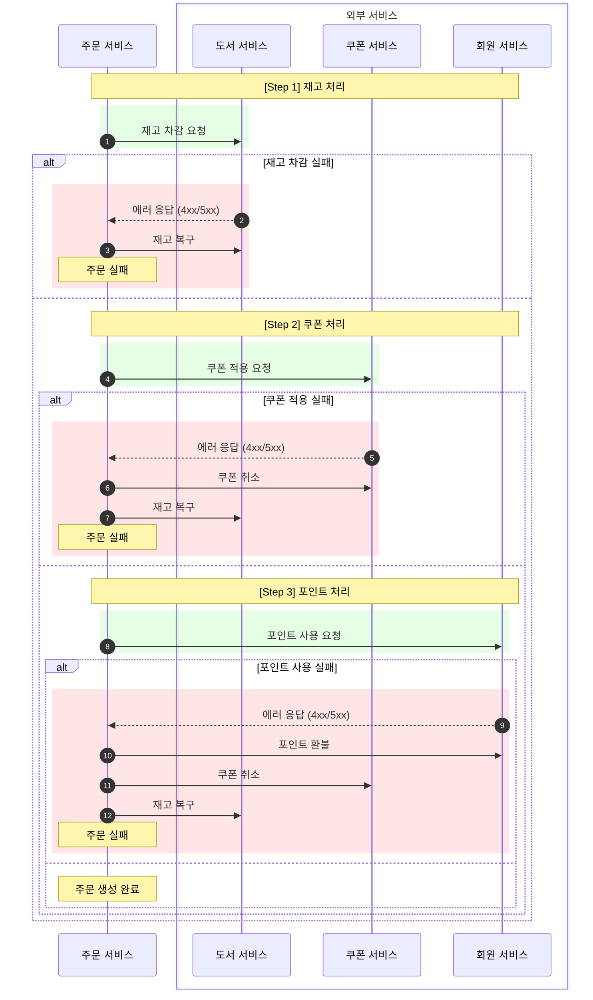
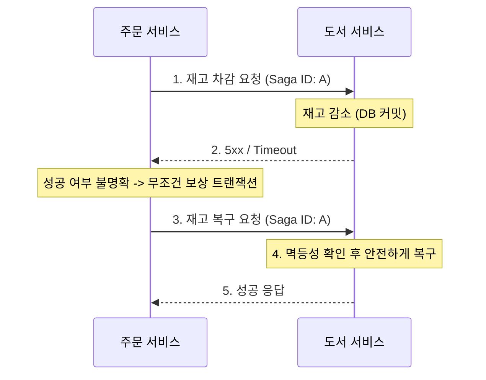

# 분산 트랜잭션과 보상 전략

---

## 목차

1. [배경 - MSA에서 주문 생성이 복잡해진 이유](#1-배경---msa에서-주문-생성이-복잡해진-이유)
2. [Orchestration Saga 선택](#2-orchestration-saga-선택)
3. [Saga 처리 전략의 이원화](#3-saga-처리-전략의-이원화)
4. [주문 생성 사가](#4-주문-생성-사가)
5. [문제 발견: 5xx는 실패인가?](#5-문제-발견-5xx는-실패인가)
6. [주문 취소 사가](#6-주문-취소-사가)
7. [결론](#7-결론)

---

## 1. 배경 - MSA에서 주문 생성이 복잡해진 이유

팀 프로젝트는 MSA 구조로 설계되었고, 각 서비스는 독립된 데이터베이스를 가진다. 주문 생성 로직은 `주문`, `도서(재고)`, `쿠폰`, `회원(포인트)` 서비스에 걸쳐 실행되는데, 단일 DB 환경이라면 `@Transactional` 하나로 해결되는 일관성 보장이 분산 환경에서는 불가능했다.

사실 처음에는 이 문제를 "그냥 `@Transactional` 쓰면 되지 않나?"라고 가볍게 생각했다. 그런데 팀원이 사가 패턴이라는걸 사용해야 한다고 해서 그제서야 찾아보기 시작했다. 찾아보니 분산 트랜잭션을 다루는 방식으로 2PC(Two-Phase Commit)와 Saga 패턴이 자주 비교되었다.

2PC는 강한 일관성을 제공하지만 참여 서비스 중 하나만 일시 장애가 나도 전체 트랜잭션이 블로킹되고, 모든 서비스가 Commit을 마칠 때까지 락을 쥐고 있어 요청이 몰리면 스레드 풀이 고갈될 위험이 크다. 가용성과 성능을 포기하면서까지 강한 일관성을 선택할 이유가 없다고 판단해 제외했다.

대신 각 서비스의 로컬 트랜잭션을 순차적으로 실행하고, 실패 시 이전 단계를 되돌리는 **Saga 패턴**을 도입했다.

---

## 2. Orchestration Saga 선택

Saga 구현 방식은 크게 두 가지다.

| 비교 항목 | Choreography | Orchestration |
| :--- | :--- | :--- |
| 제어 방식 | 서비스 간 이벤트 발행·구독 | 중앙 오케스트레이터가 명령·응답 제어 |
| 흐름 파악 | 전체 흐름 추적이 어려움 | 한 곳에서 상태 관리 가능 |
| 적합한 환경 | 참여 서비스가 적고 흐름이 단순할 때 | 조건 분기가 많고 트랜잭션 단계가 복잡할 때 |

주문 생성 과정에서 재고, 쿠폰, 포인트를 순서대로 검증하고 실패 시 역순 보상을 해야 했기 때문에 흐름 가시성과 상태 통제가 중요했다. **Orchestration** 방식을 선택한 이유다.

통신 방식은 비동기 메시지 큐 대신 **OpenFeign 기반 동기 호출**을 선택했다. 재고 부족이나 쿠폰 유효성 같은 정보는 사용자가 즉각적인 피드백을 받아야 하는데, 비동기 처리 시 "접수 완료 후 재고 부족으로 사후 취소"같은 흐름이 생긴다. 주문이 완료됐다고 확인한 사용자 입장에서 이후에 취소 통보를 받는 것은 말이 안 되는 경험이다. 또한 8주라는 프로젝트 일정 안에서 메시지 유실 방지, 중복 수신 처리, DLQ 설계 같은 메시지 큐 운영 복잡도까지 가져가기보다 분산 트랜잭션의 데이터 정합성을 먼저 잡는 것이 맞다고 판단했다.

동기 호출은 외부 서비스가 응답하지 않으면 스레드가 그대로 블로킹된다. 요청이 몰리는 상황에서 특정 서비스가 느려지면 스레드 풀이 고갈되고, 그 장애가 주문 서비스 전체로 전파될 수 있다. Resilience4j Circuit Breaker를 적용해 외부 서비스 호출 실패가 일정 횟수를 넘으면 서킷이 열려 이후 요청을 즉시 실패 처리하도록 차단했다.

### Saga 엔티티 구조

프로젝트에는 주문 생성, 주문 취소 외에도 여러 종류의 사가가 존재했다. 각 사가마다 `sagaId`, `orderId`, `overallStatus`, `bridged` 같은 공통 필드가 반복되었는데, 이를 개별 엔티티마다 따로 관리하면 구조적 일관성이 깨질 수 있었다. 공통 필드를 추상 부모 클래스로 묶고, 각 사가 타입별로 다른 `lastCompletedStep` Enum만 자식 클래스에서 정의하는 방식으로 설계했다.

```java
public abstract class OrderSaga extends BaseTimeEntity {
    @Id
    private UUID sagaId;               // 멱등성 식별을 위한 고유 트랜잭션 키

    private Long orderId;              // 보상 트랜잭션 적용 대상 주문 ID

    private SagaStatus overallStatus;  // 사가 전체 상태 (PROGRESS, COMPLETED, FAILED)

    private boolean bridged = false;   // 주문 도메인 상태와 최종 동기화 완료 여부
}

public class OrderCreateSaga extends OrderSaga {
    private CreateSagaStep lastCompletedStep; // 마지막으로 성공한 체크포인트 단계
}
```

---

## 3. Saga 처리 전략의 이원화

구현하다 보니 주문 생성과 주문 취소를 같은 전략으로 복구할 수 없다는 걸 깨달았다.

**주문 생성**은 재고, 쿠폰, 포인트 중 하나라도 실패하면 전체를 되돌려야 한다. 당연한 일이다. 주문 생성 조건을 만족하지 못했기 때문이다.

**주문 취소**는 다르다. 처음에는 취소도 실패하면 롤백하면 되지 않나 싶었는데, 생각해보니 그렇지 않았다. 고객의 취소 의사가 이미 시스템에 저장된 이상, 중간에 타 서비스 오류가 나더라도 결국 취소는 완료되어야 한다. 게다가 취소 과정에서 재고를 복구하는 도중 해당 재고가 이미 다른 구매자에게 팔렸다면, 롤백 쿼리 자체가 불가능한 상태가 된다. 취소 도중 실패했다고 주문을 다시 살리는 것은 비즈니스 모순이다.

| 구분 | 주문 생성 Saga | 주문 취소 Saga |
| :--- | :--- | :--- |
| 지향 | All-or-Nothing | 결과적 일관성 |
| 장애 복구 | 보상 트랜잭션 (Rollback) | 정순 재시도 (Retry) |
| 실패 시 | 즉시 역순 원복 후 실패 반환 | 성공할 때까지 스케줄러가 재시도 |

---

## 4. 주문 생성 사가

### 전체 프로세스



1. **초기 주문 저장**: 사가 시작 전 주문을 `CREATING` 상태로 먼저 저장한다. 서버가 다운되더라도 복구 대상을 조회할 수 있는 기준점이 된다.
2. **사가 시작**: UUID를 멱등성 키로 부여하고 사가 엔티티를 커밋한다.
3. **오케스트레이션**: 재고 → 쿠폰 → 포인트 순서로 외부 서비스를 호출한다.
4. **상태 동기화**: 모든 단계가 성공하면 주문 상태를 `PENDING`으로 전환하고 `bridged = true`로 마킹한다. 사가가 `COMPLETED`로 완수되어도 이 마지막 반영 단계에서 예외가 발생하면 주문 도메인 상태는 여전히 `CREATING`에 머문다. `bridged` 플래그는 스케줄러가 이 불일치를 감지하고 재동기화할 수 있는 기준점 역할을 한다.

### 단계별 상태 전이 (CreateSagaStep)

| 단계 | 상태 | 설명 |
| :--- | :--- | :--- |
| 1 | `STARTED` | 사가 인스턴스 생성 |
| 2 | `STOCK_DECREASING` | 재고 차감 요청 송신 중 **(선기록)** |
| 3 | `STOCK_DECREASED` | 재고 차감 완료 |
| 4 | `COUPON_APPLYING` | 쿠폰 적용 요청 송신 중 **(선기록)** |
| 5 | `COUPON_APPLIED` | 쿠폰 적용 완료 |
| 6 | `POINT_USING` | 포인트 사용 요청 송신 중 **(선기록)** |
| 7 | `POINT_USED` | 포인트 사용 완료 |

처음에는 완료 상태(`STOCK_DECREASED`)만 기록했다. 로컬에서 도서 서비스와 주문 서비스를 함께 띄워 테스트하다가 문제를 발견했다. 서버를 강제 종료했을 때 도서 재고는 차감되어 있는데 주문 상태는 `CREATING`에 멈춰있는 경우가 생겼다. DB에 아무 기록도 남지 않으니 스케줄러가 나중에 이 사가를 발견해도 재고가 이미 차감되었는지 알 방법이 없어 안전하게 보상 트랜잭션을 실행하기 어려웠다.

그래서 `STOCK_DECREASING` 같은 진행 중 상태를 외부 API 호출 **직전**에 먼저 저장하도록 했다. 선기록된 상태를 보고 스케줄러가 "요청은 나갔지만 성공 여부를 알 수 없는 단계"로 명확히 인식할 수 있고, 이를 기준으로 안전하게 보상 트랜잭션을 실행한다.

---

## 5. 문제 발견: 5xx는 실패인가?

구현이 어느 정도 완성됐다고 생각하던 시점에 팀원이 토스 유튜브 영상을 공유해줬다. 네트워크 장애와 멱등성에 대해 다루는 영상이었는데, 거기서 5xx 케이스를 처음 인식했다.

4xx는 명확하다. 재고 부족, 쿠폰 미존재처럼 요청 자체가 거부된 것이므로 보상 트랜잭션을 실행하면 된다.

5xx는 다르다. 요청이 수신 서비스의 DB에 반영되었는데 응답 직전에 네트워크가 끊기면, 주문 서비스 입장에서는 처리 성공 여부를 알 수 없다. 이 상태에서 보상 트랜잭션을 보내지 않으면 차감된 재고가 복구되지 않는다. 그렇다고 실패한 요청에 무조건 보상 트랜잭션을 보내면, 처리되지도 않은 재고를 복구하는 문제가 생긴다.



고민 끝에 **5xx는 무조건 보상 트랜잭션을 보내는 것으로 결정했다.** 처리됐을지도 모르는 데이터를 취소하는 것이, 처리 여부를 모른 채 방치하는 것보다 정합성 관리가 훨씬 쉽기 때문이다. 대신 수신 서비스들이 중복 요청을 안전하게 처리할 수 있어야 했다. **멱등성(Idempotency)** 설계가 필요한 이유다.

### 멱등성 설계

#### Saga Log 테이블 방식 (도서, 회원 서비스)

`sagaId`를 유니크 키로 저장해 중복 실행을 필터링한다.

그런데 선기록 방식을 도입하면서 한 가지 더 고려해야 할 케이스가 생겼다. `STOCK_DECREASING` 상태가 기록되어 있다는 건 요청이 나갔다는 의미지, 실제로 차감이 완료됐다는 의미가 아니다. 요청이 수신 서비스에 도달하기 전에 서버가 다운된 경우라면 차감은 일어나지 않은 상태다. 이런 상황에 보상 트랜잭션이 오면 없는 재고를 복구하려는 시도가 된다.

그래서 `rollbackStock`에서는 복구 전에 차감 이력(`DECREASE_STOCK`)이 실제로 존재하는지 먼저 확인한다.

```java
@Transactional
public void decreaseStock(UUID sagaId, Map<Long, Integer> quantityMap) {
    OrderBookSagaLogId sagaLogId = new OrderBookSagaLogId(sagaId, OrderSagaType.DECREASE_STOCK);

    if (orderBookSagaLogRepository.existsById(sagaLogId)) {
        return; // 이미 처리된 요청
    }

    orderBookRepository.decreaseStock(quantityMap);
    orderBookSagaLogRepository.save(new OrderBookSagaLog(sagaLogId));
}

@Transactional
public void rollbackStock(UUID sagaId, Map<Long, Integer> quantityMap) {
    OrderBookSagaLogId sagaLogId = new OrderBookSagaLogId(sagaId, OrderSagaType.ROLLBACK_STOCK);

    if (orderBookSagaLogRepository.existsById(sagaLogId)) {
        return; // 이미 롤백 완료
    }

    // 차감 이력 자체가 없다면 복구할 것도 없음
    boolean hasDecreased = orderBookSagaLogRepository.existsById(
        new OrderBookSagaLogId(sagaId, OrderSagaType.DECREASE_STOCK)
    );
    if (!hasDecreased) {
        return;
    }

    orderBookRepository.increaseStock(quantityMap);
    orderBookSagaLogRepository.save(new OrderBookSagaLog(sagaLogId));
}
```

#### 상태 전이 필터 방식 (쿠폰 서비스)

쿠폰은 `is_used` 상태가 이진값이라 조건부 UPDATE 자체가 멱등하다.

```sql
UPDATE coupons SET is_used = true WHERE coupon_id = ? AND is_used = false
```

이미 사용된 쿠폰에 동일 요청이 오면 영향 행이 0이 되어 자연스럽게 중복 처리가 방지된다.

---

## 6. 주문 취소 사가

취소 사가는 롤백 없이 끝까지 완료하는 방향으로 설계했는데, 이유는 위에서 언급했듯이 사용자가 취소를 결정했기 때문이다.

### 단계별 상태 전이 (CancelSagaStep)

| 단계 | 상태 | 설명 |
| :--- | :--- | :--- |
| 1 | `STARTED` | 취소 트랜잭션 시작 |
| 2 | `PAYMENT_CANCELED` | PG 환불 완료 |
| 3 | `POINT_REFUNDED` | 포인트 복구 완료 |
| 4 | `COUPON_RESTORED` | 쿠폰 복구 완료 |
| 5 | `STOCK_INCREASED` | 재고 복구 완료 |

### 재시도 로직

취소 도중 실패했다고 처음부터 다시 실행하면 안 된다. 이미 완료된 PG 환불 단계를 다시 호출하면 중복 환불이 나가고, 사용자는 취소가 됐다가 안 됐다가 하는 경험을 하게 된다. 취소를 취소하는 것 자체가 비즈니스적으로 치명적인 사용자 경험이기 때문에, `lastCompletedStep`을 기준으로 완료되지 않은 단계만 이어서 실행한다.

```java
public void retry(OrderCancelSaga saga, Order order) {
    CancelSagaStep currentStep = saga.getLastCompletedStep();

    if (currentStep.ordinal() < CancelSagaStep.PAYMENT_CANCELED.ordinal()) {
        paymentFlowService.cancelPaymentByMember(...);
        sagaUpdateService.updateCancelSagaStep(saga, CancelSagaStep.PAYMENT_CANCELED);
    }

    if (currentStep.ordinal() < CancelSagaStep.POINT_REFUNDED.ordinal()) {
        memberService.increasePoint(...);
        sagaUpdateService.updateCancelSagaStep(saga, CancelSagaStep.POINT_REFUNDED);
    }

    // ... 최종 단계까지 순서대로 실행
}
```

---

## 7. 결론

Saga 패턴을 구현하면서 분산 환경에서의 트랜잭션은 단순히 롤백 로직을 추가하는 것 이상의 문제라는 걸 알았다.

가장 인상적이었던 것은 5xx 에러를 다루는 부분이었다. 단일 DB 환경에서는 실패는 곧 롤백이라 단순하다. 하지만 분산 환경에서는 요청이 성공했는지 실패했는지 자체를 알 수 없는 상황이 존재한다. 이 불확실성을 다루기 위해 "무조건 보상 트랜잭션 + 멱등성"이라는 조합이 필요했고, 그 설계가 생각보다 복잡했다.

그런데 보상 트랜잭션 자체도 실패할 수 있다. 이 문제를 해결하기 위해 별도의 보정 스케줄러를 구축했다. 스케줄러가 주기적으로 미완료 사가를 스캔해 보상 트랜잭션을 재시도하는 구조다.

선기록 전략이나 멱등성 설계처럼 분산 트랜잭션에서는 고려해야 할 예외 상황이 굉장히 많았다. 분산 트랜잭션은 정상 흐름보다 장애 흐름을 먼저 생각해야 한다는 것이 이번 구현에서 얻은 가장 큰 교훈이었다.