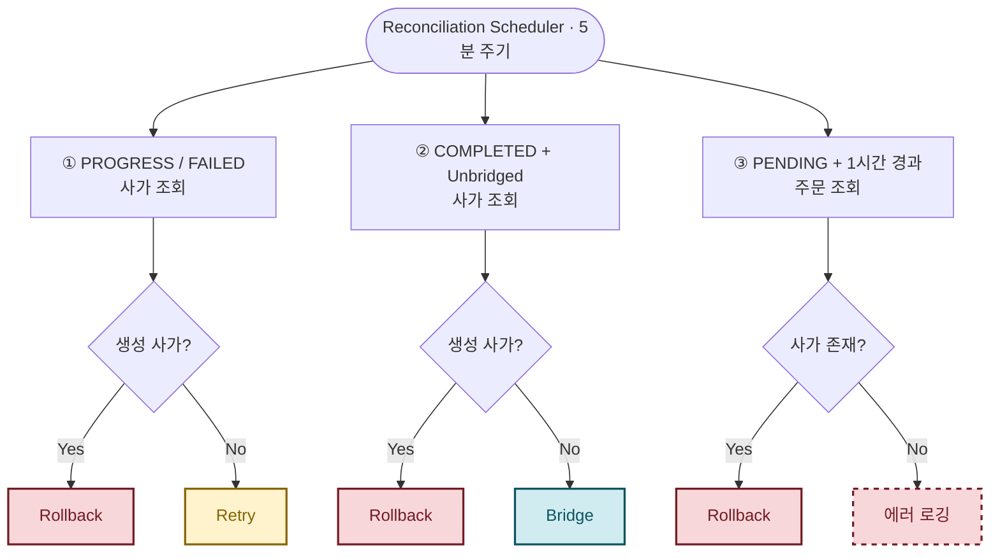

# 보상 트랜잭션은 어떻게 보상하나 - Saga 보상 스케줄러 설계

---

## 목차

1. [배경 - 서버가 죽으면 어떻게 되나](#1-배경---서버가-죽으면-어떻게-되나)
2. [복구 방식 선택](#2-복구-방식-선택)
3. [보정 스케줄러 설계](#3-보정-스케줄러-설계)
4. [결론](#4-결론)

---

## 1. 배경 - 서버가 죽으면 어떻게 되나

분산 트랜잭션 구현이 어느 정도 마무리됐다고 생각하던 시점에 팀원이 물었다. *"여기서 서버가 멈추면 어떻게 되나요?"* 그 질문 하나가 스케줄러 설계 전체의 시작이었다.

Saga 오케스트레이터가 실행 중에 서버가 비정상 종료되거나 재배포로 재시작되면 메모리 상의 실행 흐름이 그대로 끊긴다. 문제는 두 가지 형태로 나타났다.

- **트랜잭션 중단**: 재고는 차감됐는데, 다음 단계인 쿠폰 API를 호출하기 직전에 서버가 다운돼 사가가 `PROGRESS` 상태로 멈춤
- **최종 반영 유실**: 사가 단계는 전부 성공했는데, 주문 상태를 `PENDING`으로 바꾸는 과정에서 예외가 발생해 사가는 `COMPLETED`지만 주문은 여전히 `CREATING`인 불일치 상태가 됨

이런 데이터는 스스로 복구되지 않는다. 백그라운드에서 주기적으로 스캔하고 보정해주는 **보정 스케줄러(Reconciliation Scheduler)**가 필요한 이유다.

---

## 2. 복구 방식 선택

### DB 상태 조회 방식을 선택한 이유

장애 복구를 위한 이벤트를 발행하는 방식도 검토했다. 하지만 서버가 OOM이나 하드웨어 에러로 아예 꺼지는 경우, 이벤트 자체를 발행할 수 없다. 설령 발행됐더라도 이벤트는 메모리나 큐에 올라간 시점에 서버가 죽으면 그대로 사라진다. 어떤 방식의 장애든 복구할 수 있으려면 DB에 이미 커밋된 사가 로그를 기준으로 삼는 게 가장 신뢰할 수 있었다. 주기적 DB 폴링 방식을 선택한 이유다.

### Spring Scheduler + ShedLock

복구 대상은 대규모 통계 가공이 아니라 짧은 주기로 멈춘 상태를 스캔하는 작업이다. 외부 배치 솔루션 없이 애플리케이션 내장 Spring Scheduler를 사용했다.

그런데 당시 모든 마이크로서비스는 무중단 운영을 위해 이중화되어 있었다. 인스턴스마다 동일한 복구 쿼리를 동시에 실행하면 중복 보상이 발생할 수 있었다. 분산 락이 필요했는데, Redis 기반 Redisson은 별도 인프라가 추가로 필요하다. 이미 사용 중인 RDB 테이블 레코드 잠금을 활용하는 **ShedLock**을 선택해 인프라를 늘리지 않고 해결했다.

ShedLock은 아래 테이블을 생성해 락을 관리한다.

```sql
CREATE TABLE shedlock (
    name       VARCHAR(64)  NOT NULL,
    lock_until TIMESTAMP    NOT NULL,
    locked_at  TIMESTAMP    NOT NULL,
    locked_by  VARCHAR(255) NOT NULL,
    PRIMARY KEY (name)
);
```

`lock_until`이 핵심이다. 스케줄러가 락을 획득하면 이 값을 현재 시각 + `lockAtMostFor`로 설정한다. 다른 인스턴스는 `lock_until`이 미래 시각이면 락 획득을 포기한다. 스케줄러가 정상 완료되면 `lock_until`을 현재 시각 + `lockAtLeastFor`로 갱신해 최소 점유 시간을 보장한다.

이중화 환경에서 ShedLock이 올바르게 동작하려면 타임아웃 설정이 중요했다.

```java
@EnableSchedulerLock(defaultLockAtMostFor = "PT4M", defaultLockAtLeastFor = "PT30S")
```

- **lockAtMostFor (4분)**: 스케줄러가 작업 중 OOM 등으로 다운되면 락이 영영 해제되지 않아 다음 주기에 모든 인스턴스가 데드락에 걸린다. 4분이 지나면 강제 해제되도록 지정했다. 스케줄러 주기(5분)보다 1분 짧게 설정해 락이 해제된 후 다음 주기가 정상 실행될 수 있도록 마진을 뒀다.
- **lockAtLeastFor (30초)**: 복구 대상이 없으면 스케줄러가 즉시 끝난다. 락이 바로 풀리면 미세한 동기화 시차로 옆 인스턴스가 락을 다시 잡아 불필요하게 DB를 한 번 더 스캔한다. 작업이 끝나도 최소 30초는 락을 유지해 중복 실행을 막는다.

---

## 3. 보정 스케줄러 설계

복구가 필요한 케이스를 정리해보니 세 가지였다. 멈춘 사가, 사가는 완료됐지만 도메인에 반영되지 않은 경우, 결제 없이 장시간 대기 중인 주문. 스케줄러는 이 세 가지를 5분 주기로 스캔한다.

### 경쟁 상태 방지

단순히 `Status = PROGRESS`인 사가를 모두 가져오면 안 된다. 스케줄러가 정상적으로 처리 중인 요청의 사가를 낚아채 롤백해버리는 경쟁 상태가 발생할수도 있기 때문이다. 사용자가 방금 주문 버튼을 눌렀는데 스케줄러가 그 사가를 실패로 판단하고 보상 트랜잭션을 실행하는 상황이 발생한다면 어떨까?

쿼리 조건에 `updatedAt < NOW - 1분`을 추가했다. 주문 생성 흐름 자체가 1분을 넘길 수 없다는 전제에서 나온 기준이다. 1분이 지나도 상태 변화가 없다면 정상 처리 중인 요청이 아니라 확실히 멈춘 데이터로 판단한다.

### 복구 정책 설계

| 시나리오            | 대상                                        | 상태                      | 동작                | 근거                                            |
|:----------------|:------------------------------------------|:------------------------|:------------------|:----------------------------------------------|
| 주문 생성 중단        | `OrderCreateSaga`                         | `PROGRESS`              | 롤백                | 1분 경과 시점에서 사가를 완료하면 재주문한 사용자의 주문이 중복 접수될 수 있음 |
| 주문 취소 중단        | `OrderCancelSaga`                         | `PROGRESS` / `FAILED`   | 재시도               | 취소는 최종 상태 — "취소의 취소"는 불가능하므로 끝까지 완료           |
| 주문 환불 중단        | `OrderItemRefundSaga`                     | `PROGRESS` / `FAILED`   | 재시도               | 관리자 승인 후 진행되는 흐름으로, 정확한 처리가 우선                |
| 도메인 미반영 (생성)    | `OrderCreateSaga`                         | `COMPLETED`             | 롤백                | 사가가 완료됐더라도 1분 이상 경과한 시점이므로 생성과 동일한 이유로 롤백     |
| 도메인 미반영 (보상)    | `OrderCreateSaga`                         | `COMPLETED_COMPENSATED` | 도메인과 동기화 (Bridge) | 보상 트랜잭션은 완료됐으나 도메인에 미반영된 상태 — 재동기화로 정합성 확보    |
| 도메인 미반영 (취소/환불) | `OrderCancelSaga` / `OrderItemRefundSaga` | `COMPLETED`             | 도메인과 동기화 (Bridge) | 사가가 성공했다면 도메인 상태를 그에 맞게 최종 동기화                |
| 미결제 장기 대기       | `Order`                                   | `PENDING` + 1시간 경과      | 롤백                | 선점된 재고·쿠폰·포인트를 명시적으로 해제할 수단이 없어 강제 회수         |

처음에는 생성 사가도 취소 사가처럼 재시도로 처리하려 했다. 그런데 스케줄러가 해당 사가를 잡는 시점에서는 이미 사용자가 주문 생성 버튼을 누르고 1분이 지난 시점이다. 아마 그렇다면 서버 오류로 사가가 정상적으로 처리되지 못한 상황일 것이다. 이 상태에서 사가를 이어 완료하면, 사용자가 이전 주문을 실패로 인식하고 다시 주문을 하게 된다면 주문이 두 번 접수되는 문제가 발생할 수 있다고 생각했다. 취소와 생성은 다르다. 사용자가 취소를 선택한 순간, 해당 주문은 "취소의 취소"가 불가능한 최종 상태다. 또한 취소를 되돌리려면 차감했던 재고, 포인트, 쿠폰을 다시 선점해야 하는데, 이미 다른 주문에 사용됐거나 만료됐을 수 있다. 그 자원이 존재하지 않으면 복구 자체가 심각한 데이터 불일치를 만들어낸다. 반면 생성 사가는 스케줄러가 잡는 시점에 이미 사용자 입장에서는 실패한 주문이다. 그래서 생성은 롤백, 취소·환불은 재시도로 분리했다.

스케줄러를 만들고 나서 한 가지 문제가 더 보였다. 주문이 생성되면 재고, 쿠폰, 포인트가 즉시 선점되는데, 결제 화면까지 간 사용자가 결제를 포기하거나 이탈하면 이 자원들이 영영 잠겨버린다. 사용자가 명시적으로 주문 취소를 하지 않는 한 해제할 방법이 없었다. 주문 생성 후 1시간이 지나도 `PENDING` 상태인 주문을 롤백하는 조건을 추가했다.



`bridged` 플래그는 주문 상태 변경과 동일한 트랜잭션 안에서 `true`로 설정된다. 이 트랜잭션이 롤백되면 `bridged`는 여전히 `false`로 남으므로, 스케줄러는 `COMPLETED && bridged = false`인 사가를 미반영 대상으로 감지하고 재동기화한다.

```java
@Transactional
public void cancelOrder(Order order, OrderCancelSaga saga) {
    // 이미 처리된 주문은 다시 처리하지 않음
    if (order.getOrderStatus() == OrderStatus.CANCELED) {
        // 하지만 도메인과 연결되지 않았을 수 있으므로 처리
        if (!saga.isBridged()) {
            saga.setBridged(true);
            orderCancelSagaRepository.save(saga);
        }
        return;
    }

    order.setOrderStatus(OrderStatus.CANCELED);
    order.getOrderItems().forEach(orderItem ->
            orderItem.setOrderItemStatus(OrderItemStatus.CANCELED)
    );

    orderRepository.save(order);

    saga.setBridged(true); // 주문 상태 변경과 같은 트랜잭션에서 설정

    orderCancelSagaRepository.save(saga);
}
```

### 사가 유실 방어

초기에는 주문 엔티티 저장과 사가 로그 저장이 별도 트랜잭션으로 나뉘어 있었다. 만약 주문이 저장된 직후, 사가가 저장되기 직전에 서버가 다운되면 주문만 남고 사가는 없는 상태가 된다. 스케줄러가 나중에 이 주문을 발견해도 사가 로그가 없으니 체크포인트 기반 복구 자체가 불가능한 구멍이었다.

`OrderInitialCreateService` 클래스를 새로 만들어 주문과 사가 초기화를 **단일 트랜잭션으로 묶었다**. 어느 시점에 서버가 다운되든 두 테이블이 같이 생성되거나 같이 롤백된다.

```java
@Transactional
public OrderInitCreateResult createInitialOrderWithSaga(..., UUID sagaId) {
    Order order = Order.createInitial(...);
    // 주문 아이템, 쿠폰 등 초기화 ...

    orderRepository.save(order);

    OrderCreateSaga saga = OrderCreateSaga.create(sagaId, order.getOrderId());
    orderCreateSagaRepository.save(saga); // 주문과 같은 트랜잭션에서 저장

    return new OrderInitCreateResult(order, saga);
}
```

---

## 4. 결론

보정 스케줄러를 설계하면서 가장 어려웠던 부분은 복구 로직 자체보다 "어떤 데이터를 복구 대상으로 삼을 것인가"를 정의하는 것이었다. 단순히 상태가 `PROGRESS`인 것을 가져오면 정상 처리 중인 데이터에 개입해버리는 문제가 생기고, 사가와 주문이 별도 트랜잭션으로 저장되어 있으면 복구 기준 자체가 사라지는 구멍이 생긴다.

결국 복구 시스템의 신뢰성은 정상 흐름에서 얼마나 꼼꼼하게 상태를 기록해두느냐에 달려있었다. 선기록 전략, 단일 트랜잭션 묶음, 유예 시간 조건 하나하나가 모두 그 기반 위에서 동작한다.

돌이켜보면 이 스케줄러가 필요해진 것 자체가 분산 트랜잭션의 복잡성을 잘 보여준다고 생각한다. 단일 DB 환경이었다면 `@Transactional` 어노테이션 하나로 끝났을 것이다. 하지만, 분산 환경에서는 Saga로 조율하고, 선기록으로 상태를 기록하고, 멱등성으로 중복을 방어하고, 그것도 부족해서 스케줄러로 사후 복구까지 해야 했다. 이 모든 것이 하나의 주문 생성을 보장하기 위한 작업들이었다.

한 가지 아쉬운 점은 현재 구조가 무한 재시도라는 점이다. 실제로 테스트 중 FK 제약조건 위반으로 특정 보상 트랜잭션이 계속 실패하는 상황이 생겼는데, Dooray 메신저로 연동된 예외 알림이 새벽 내내 울렸다. 일시적 장애라면 결국 성공하겠지만, 이처럼 구조적인 이유로 실패하는 사가는 스케줄러가 영원히 같은 항목을 재시도하게 된다. 일정 횟수 이상 실패한 사가를 DLQ(Dead Letter Queue)로 분리해 별도로 처리했어야 했다.