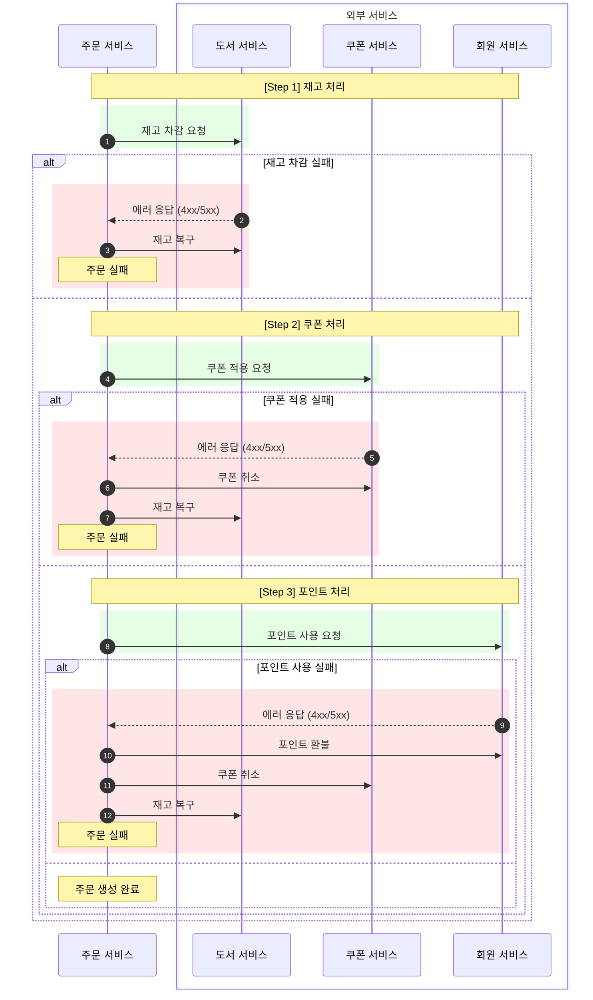
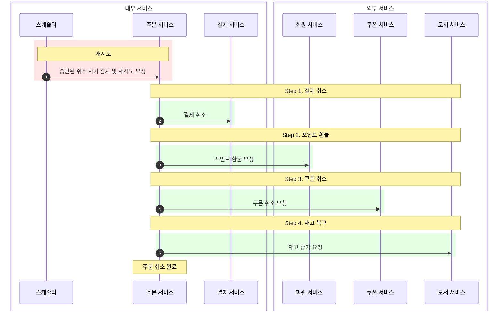

# 📘 [Saga Pattern] 분산 트랜잭션 구현과 5xx 에러 처리 전략

> **Core Question:** "단일 데이터베이스가 아닌 MSA 환경에서 어떻게 데이터 정합성(Data Consistency)을 보장할 것인가?"

---

## 1. 배경 및 문제 정의

### 1.1. MSA와 Database per Service
모놀리식(Monolithic) 아키텍처에서는 모든 데이터가 단일 데이터베이스에 존재하므로, DBMS가 제공하는 ACID 트랜잭션(`@Transactional`) 하나로 강력한 데이터 일관성을 보장할 수 있었음.
하지만 마이크로서비스 아키텍처(MSA)를 도입하고 **Database per Service** 패턴을 적용함에 따라, 주문 로직이 여러 서비스(`Order`, `Book`, `Coupon`, `Member`)와 데이터베이스에 걸쳐 실행되는 상황이 됨.

### 1.2. 2PC (Two-Phase Commit)의 한계
**2PC(Two-Phase Commit)**란 분산 환경의 모든 노드가 트랜잭션을 커밋할 준비가 되었는지 확인하는 **준비(Prepare)** 단계와, 실제로 커밋을 수행하는 **커밋(Commit)** 단계로 나누어 처리하는 합의 알고리즘임. 데이터의 **강한 일관성(Strong Consistency)** 을 보장한다는 장점이 있지만, 다음과 같은 이유로 본 프로젝트에서 배제함.

*   **성능 저하:** 모든 참여자가 준비(Prepare)될 때까지 락(Lock)을 유지해야 하므로 처리량이 급격히 저하됨.
*   **가용성 문제:** 코디네이터나 참여자 중 하나라도 응답하지 않으면 전체 시스템이 블로킹될 위험이 있음.
*   **NoSQL 지원 미비:** 현대적인 NoSQL 데이터베이스들은 2PC를 지원하지 않는 경우가 많음.

따라서 우리는 **Saga Pattern**을 도입하여, 각 로컬 트랜잭션을 순차적으로 실행하고 실패 시 **보상 트랜잭션(Compensating Transaction)** 을 통해 데이터의 **결과적 일관성(Eventual Consistency)** 을 보장하는 전략을 선택함.

---

## 2. 아키텍처 결정: Orchestration Saga

**Saga Pattern이란?** 분산 시스템에서 긴 트랜잭션(Long-lived Transaction)을 여러 개의 짧은 로컬 트랜잭션으로 나누어 순차적으로 실행하고, 중간에 실패 시 이전 단계들을 취소하는 **보상 트랜잭션(Compensating Transaction)** 을 실행하여 데이터 정합성을 맞추는 패턴임.

Saga 패턴을 구현하는 방식에는 크게 **Choreography(안무)**와 **Orchestration(지휘)** 두 가지가 있으며, 본 프로젝트는 **Orchestration** 방식을 채택함.

| 비교 항목 | Choreography (안무) | Orchestration (지휘) |
| :--- | :--- | :--- |
| **제어 방식** | 서비스 간 이벤트 구독/발행 (Decentralized) | 중앙 조정자가 명령/응답 제어 (Centralized) |
| **주요 장점** | 서비스 간 결합도가 낮고 독립적 확장 용이 | **비즈니스 흐름 가시성이 높고 상태 관리 용이** |
| **주요 단점** | 전체 흐름 파악 및 트러블슈팅이 어려움 | 오케스트레이터에 대한 의존성 및 복잡도 발생 |
| **데이터 정합성** | 이벤트 추적을 통해 간접적으로 파악 | **중앙에서 즉각적인 정합성 확인 가능** |
| **적합한 상황** | 흐름이 단순하고 참여자가 적을 때 | **비즈니스 로직이 복잡하고 단계가 많을 때** |

### 2.1. 선택 이유
1.  **중앙 집중형 제어 (Centralized Control):** 주문 생성 프로세스는 `재고 -> 쿠폰 -> 포인트` 등 순서가 중요하고 복잡함. 이를 `주문 서비스`가 중앙에서 제어함으로써 비즈니스 로직의 흐름을 한눈에 파악하고 관리하기 용이함.
2.  **순환 의존성 방지:** Choreography 방식은 서비스끼리 이벤트를 주고받으며 복잡한 의존 관계가 형성될 수 있지만, Orchestration은 오케스트레이터가 모든 것을 통제하므로 의존성이 단순해짐.
3.  **상태 추적 용이:** 트랜잭션이 현재 어느 단계에 있고 어디서 실패했는지 명확하게 알 수 있어 모니터링과 디버깅에 유리함.

### 2.2. OrderCreateOrchestrator의 역할
*   **트랜잭션 조율:** 각 단계별로 외부 서비스(Feign Client)를 호출함.
*   **상태 관리:** `CreateSagaStep` Enum을 통해 현재 진행 단계를 DB에 기록함.
*   **보상 처리:** 실패 감지 시, 기록된 상태를 역추적하여 필요한 보상 트랜잭션만 실행함.

---

## 3. Saga 처리 전략의 이원화

본 프로젝트는 **주문 생성**과 **주문 취소**라는 두 가지 비즈니스 시나리오의 성격이 본질적으로 다르다는 점에 주목하여, 각각 다른 Saga 처리 전략을 적용함.

*   **주문 생성 (Order Creation):** 고객의 요청이 아직 처리 중인 단계. 재고 부족이나 결제 실패 등 예외가 발생하면, 즉시 모든 변경 사항을 원복(Rollback)하고 고객에게 실패를 알려야 함.
*   **주문 취소 (Order Cancellation):** 고객의 취소 요청이 이미 시스템에 접수된 단계. 내부 시스템의 일시적인 오류로 처리가 지연되더라도, 시스템은 끝까지 책임을 지고 취소를 완료(Guarantee Fulfillment)해야 함.

이러한 비즈니스적 차이를 반영하여 다음과 같이 처리 전략을 이원화함.

### 3.1. 생성(Creation) vs 취소(Cancellation)

| 구분 | 주문 생성 Saga (OrderCreateSaga)        | 주문 취소 Saga (OrderCancelSaga) |
| :--- |:------------------------------------|:----------------------------------|
| **목표** | 원자적 생성 보장 (All or Nothing)          | 최종적인 취소 보장 (Must Succeed)           |
| **복구 전략** | **Backward Recovery (보상 트랜잭션)** | **Forward Recovery (재시도)**         |
| **실패 시** | 역순으로 Rollback 후 사용자에게 '실패' 응답             | 성공할 때까지 스케줄러가 무한 재시도              |
| **상태 관리** | `-ing`(요청 중) 상태 필요 (어디서 멈췄는지 정밀 추적) | 완료된 체크포인트(`-ed`)만 관리 (멱등성 기반 재시도) |

### 3.2. 상태 관리의 차이점 (Why '-ing' state?)
특히 **주문 생성 Saga**에서는 `STOCK_DECREASING` 같은 **진행 중(-ing)** 상태를 별도로 관리함. 이는 일종의 **Write-Ahead Logging(WAL)** 전략과 유사함.

*   **문제 상황:** 만약 `-ing` 상태 없이 요청을 보낸다면?
    1.  `재고 차감 API` 호출 (성공)
    2.  응답을 받고 DB에 `재고 차감 완료` 기록하려는 순간 **서버 다운**
    3.  재부팅 후 DB 확인 시 상태는 여전히 `STARTED`(시작 전)
    4.  결과: 재고는 빠졌는데 시스템은 시도조차 안 한 것으로 인지하여 **재고 누락(고아 데이터)** 발생.
*   **해결:** 요청을 보내기 **직전**에 `-ing` 상태를 먼저 기록함.
    *   재부팅 후 `-ing` 상태가 남아있다면 "시도는 했으나 결과는 모르는 상태"로 판단하여 무조건 **보상 트랜잭션**을 수행할 수 있음.

반면, **주문 취소 Saga**에서는 `-ing` 상태를 관리하지 않음.
*   **이유:** 취소 전략은 **재시도(Forward Recovery)** 이므로, 실패 시 되돌릴(Rollback) 필요가 없음.
*   **동작:** "요청을 보냈으나 응답을 못 받은 상태"라면, 스케줄러가 다음 실행 주기 때 **그냥 다시 요청**하면 됨 (API 멱등성 보장 전제).
*   따라서 "어디서 멈췄는지"를 정밀하게 추적할 비용을 들일 필요 없이, **"어디까지 성공했는지(Checkpoint)"** 만 관리하면 충분함.

---

## 4. 주문 생성 사가 (OrderCreateSaga)

### 4.1. 사가 상태 단계
트랜잭션의 각 단계는 `CreateSagaStep`으로 관리되며, 성공 여부에 따라 상태가 전이됨.

| 단계 | 상태 Enum | 설명 |
| --- | --- | --- |
| 1 | `STARTED` | 사가 시작 |
| 2 | `STOCK_DECREASING` | 재고 차감 요청 중 |
| 3 | `STOCK_DECREASED` | 재고 차감 완료 |
| 4 | `COUPON_APPLYING` | 쿠폰 적용 요청 중 |
| 5 | `COUPON_APPLIED` | 쿠폰 적용 완료 |
| 6 | `POINT_USING` | 포인트 사용 요청 중 |
| 7 | `POINT_USED` | 포인트 사용 완료 |
| 8 | `COMPLETED` | 주문 생성 성공 (최종) |

### 4.2. 사가 프로세스
주문 생성 프로세스의 성공과 실패 시나리오는 다음과 같음.

## 5. 주문 취소 사가 (OrderCancelSaga)

### 5.1. 사가 상태 단계

| 단계 | 상태 Enum           | 설명           |
| --- |-------------------|--------------|
| 1 | `STARTED`         | 사가 시작        |
| 2 | `PAYMENT_CANCELED` | 결제 취소        |
| 3 | `POINT_REFUNDED`  | 포인트 반환       |
| 4 | `COUPON_RESTORED` | 쿠폰 취소        |
| 5 | `STOCK_INCREASED` | 재고 증가        |

### 5.2. 사가 프로세스

주문 취소 사가는 실패 시 롤백하지 않고, **스케줄러에 의해 성공할 때까지 재시도**됨.

> **💡 안정적인 재시도를 위한 기술적 장치**
> *   **Resilience4j:** 일시적인 네트워크 불안정은 Feign Client 레벨의 Retry로 1차 방어함.
> *   **Scheduler:** 시스템 장애 등으로 길어진 중단은 스케줄러가 감지하여 재시도함.
> *   **ShedLock:** 다중 인스턴스 환경에서 스케줄러가 중복 실행되어 불필요한 트래픽을 유발하지 않도록 분산 락을 적용함. (상세 내용은 [Reliability-Scheduling] 위키 참조)

---

## 6. 5xx 에러와 멱등성(Idempotency) 보장 전략

분산 시스템에서 가장 다루기 까다로운 문제는 외부 서비스 호출 시 발생하는 **Timeout**이나 **5xx (Internal Server Error)** 임.

### 6.1. 불확실한 상태 (Indeterminate State)
외부 서비스에 요청을 보냈는데 5xx 에러가 오거나 응답이 오지 않는 경우(Timeout), 클라이언트는 **요청이 처리되고 응답만 못 받은 것인지**, 아니면 **요청 자체가 처리되지 않은 것인지** 알 수 없음.

*   **시나리오:** 재고 차감 요청 -> 도서 서비스 DB 커밋 성공 -> 응답 전송 중 네트워크 오류 -> 주문 서비스는 Timeout 예외 발생

### 6.2. 해결책: 무조건적인 보상 트랜잭션 수행
이러한 불확실성을 해결하기 위해, **요청이 실패하면(4xx, 5xx 불문) 무조건 보상 트랜잭션(Rollback)을 수행**하는 공격적인 복구 전략을 채택함.

*   **설계 의도:** "혹시라도 처리되었을지 모르는 데이터"를 남겨두는 것보다, 확실하게 취소를 요청하여 정합성을 맞추는 것이 안전하다고 판단함.

### 6.3. 멱등성(Idempotency) 설계의 필수성
이 전략이 유효하려면, 모든 참여자 서비스(Book, Coupon, Member)의 **취소/복구 API는 멱등성을 보장**해야 함.

*   **구현 방법 (Key):** Saga 시작 시 발급된 고유한 **UUID (Saga ID)** 를 모든 외부 API 호출 시 함께 전달함. 수신 측 서비스는 이 **Saga ID를 중복 검사 키(Deduplication Key)**로 사용하여 이미 처리된 요청은 무시하고 성공 응답을 반환함.
*   **멱등성이란?** 연산을 여러 번 적용하더라도 결과가 달라지지 않는 성질.
*   **주문 취소에 대한 멱등성 구현 예시:**
    *   **도서 재고 증가 API:** "주문번호 A에 대한 재고 증가 내역이 없다면 증가. 있다면 무시."
    *   **쿠폰 취소 API:** "주문번호 B에 사용된 쿠폰이 있다면 사용 취소. 이미 취소되었거나 사용 이력이 없다면 무시."

이를 통해 오케스트레이터가 중복으로 롤백 요청을 보내더라도 데이터가 꼬이는 문제를 방지함.

---

## 7. 회고 및 한계점

### 7.1. 성과
*   복잡한 주문 프로세스를 단일 진입점(`OrderCreateOrchestrator`)에서 명확하게 관리할 수 있게 됨.
*   5xx 에러 상황까지 고려한 방어적 프로그래밍으로 데이터 정합성 신뢰도를 높임.
*   Backward와 Forward Recovery를 적재적소에 배치하여 비즈니스 요구사항을 충족함.

### 7.2. 한계 및 개선 방향
*   **동기 호출의 성능 이슈:** 모든 단계가 HTTP 동기 호출로 이루어져 있어, 전체 응답 시간이 가장 느린 외부 서비스에 종속됨.
*   **Blocking:** 외부 서비스 장애 시 스레드가 블로킹되는 문제가 있어, 향후 **Kafka 등을 도입하여 비동기 이벤트 기반(EDA)**으로 고도화할 계획임.
