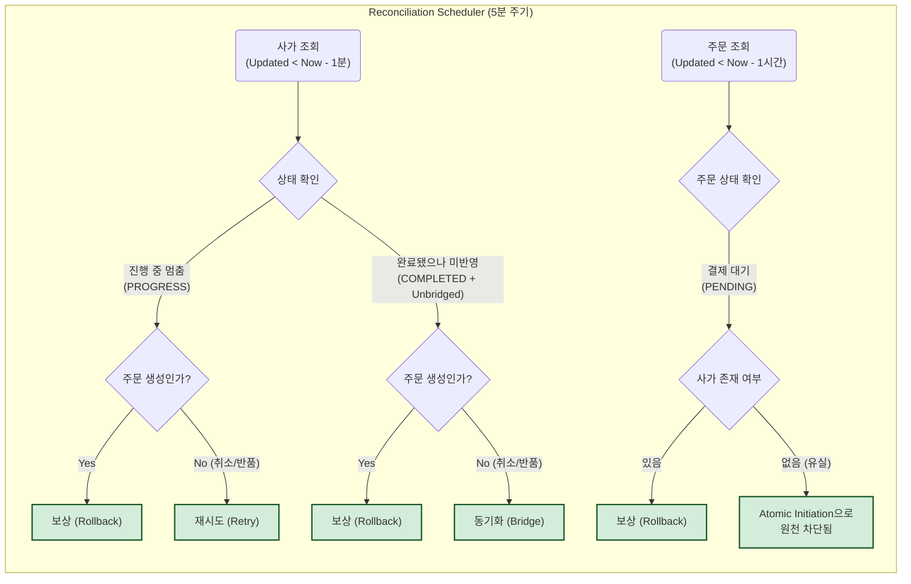

# 데이터 정합성 복구를 위한 스케줄링 전략

> 시스템 장애, 배포, 네트워크 단절 등으로 인해 중단된 분산 트랜잭션을 어떻게 처리할 것인가?

---

## 1. 배경 및 문제 정의

### 1.1. 분산 시스템의 불확실성
앞선 [Saga Pattern 문서](https://github.com/nhnacademy/order-api/wiki/Saga-Pattern)에서 설명했듯이, 주문 서비스는 Saga 패턴을 이용해 분산 트랜잭션을 관리함.
하지만 Saga Orchestrator가 메모리 상에서 로직을 수행하던 중 **서버가 비정상 종료(Crash)** 되거나 **배포(Restart)** 가 발생한다면 다음과 같은 문제가 발생함.

1.  **진행 중단:** `재고 차감`은 성공했으나, 다음 단계인 `쿠폰 사용`을 호출하기 직전에 주문 서버가 꺼짐. DB에는 여전히 `PROGRESS`(진행 중) 상태로 남아있음.
2.  **결과 유실:** 사가 트랜잭션은 모두 성공(`COMPLETED`)했으나, 최종적으로 주문 상태를 `PENDING`으로 변경하는 과정에서 에러가 발생하여 주문은 영원히 `CREATING` 상태로 남거나 흐름이 끊김.

이러한 **중단된 트랜잭션** 들은 스스로 복구되지 않으므로, 외부에서 주기적으로 상태를 검사하고 처리를 마무리해주는 **보정 스케줄러(Reconciliation Scheduler)** 가 필요함.

---

## 2. 아키텍처 결정: DB 조회 방식

### 2.1. 이벤트 발행 vs DB 조회
복구 메커니즘을 설계할 때, "실패를 어떻게 감지할 것인가?"에 대해 다음과 같이 비교함.

| 방식 | 이벤트 발행 (Event / DLQ) | DB 조회 |
| :--- | :--- | :--- |
| **동작** | 실패 시 메시지 큐나 `@EventListener`로 이벤트 발행 | 주기적으로 DB를 조회하여 멈춘 데이터를 찾음 |
| **장점** | 실시간성이 높고 DB 부하가 적음 | **구현이 단순하고, 메시지 유실 걱정이 없음** |
| **단점** | 서버 종료 시 **장애 시점의 상태 정보 전달이 불가능**할 수 있음 | 주기적인 DB 조회 쿼리 부하 발생 |

* 서버가 비정상적으로 종료되는 상황에서는 이벤트 발행 자체가 불가능할 수 있음. 따라서 **DB에 기록된 상태** 를 주기적으로 확인하는 방식이 가장 확실한 복구 수단이라고 판단함.

### 2.2. Spring Scheduler 활용 이유
*   **복잡도 최소화:** 별도의 외부 배치 시스템을 운영하는 대신, 도메인 로직을 가장 잘 아는 주문 서비스 내부에서 복구 로직을 처리하여 응집도를 높임.

### 2.3. ShedLock 도입 이유
*   **중복 실행 방지:** 다중 인스턴스 환경에서 동일 주문에 대해 중복 보상이 발생하지 않도록 분산 락을 적용함.
*   **인프라 효율성:** 별도의 Redis 구축 없이 기존 RDB를 활용하여 강력한 영속성과 트랜잭션을 보장하는 락 메커니즘을 구현함.

---

## 3. 복구(Reconciliation) 전략

### 3.1. 시나리오별 복구 정책

| 시나리오 | 대상 (Target) | 상태 (Status) | 동작 (Action) | 근거 (Rationale) |
| :--- | :--- | :--- | :--- | :--- |
| **주문 생성 중단** | `OrderCreateSaga` | `PROGRESS` / `COMPENSATED` | **보상 (Compensate)** | 생성이 지연된 주문은 실패로 처리하고, 선점된 자원을 빠르게 반환하는 것이 유리함. |
| **주문 취소 중단** | `OrderCancelSaga` | `PROGRESS` / `FAILED` | **재시도 (Retry)** | 취소는 반드시 성공해야 하는 과업이므로, 성공할 때까지 계속 재시도함. |
| **주문 반품 중단** | `OrderItemRefundSaga` | `PROGRESS` / `FAILED` | **재시도 (Retry)** | 관리자 승인 후 진행되는 프로세스 특성상 실시간성보다 정확한 처리가 더 중요함. 결과적 일관성 확보가 사용자 경험을 해치지 않는 영역임. |
| **도메인 미반영 (주문 생성)** | `OrderCreateSaga` | `COMPLETED` | **보상 (Compensate)** | 외부 API는 성공했으나 내부 DB 반영 실패 시, 불확실성을 제거하기 위해 전체 롤백 처리함. |
| **도메인 미반영 (취소/반품)** | `OrderCancelSaga` / `OrderItemRefundSaga` | `COMPLETED` | **재동기화 (Bridge)** | 사가가 성공했다면 도메인 상태를 그에 맞게 최종 동기화함. |
| **장기 대기 주문** | `Order` | `PENDING` | **보상 (Compensate)** | 1시간 이상 결제가 진행되지 않은 주문은 자원 반환을 위해 정리함. |

### 3.2. 사가 유실 문제
과거에는 주문 저장과 사가 생성이 분리된 트랜잭션으로 처리되어, 그 사이 서버 장애 시 **주문은 생성됐으나 사가는 없는** 문제가 발생할 수 있었음.

*   **해결책: `OrderInitialCreateService`** 내에서 주문(`Order`)과 사가(`Saga`) 저장을 **하나의 트랜잭션(`@Transactional`)**으로 묶어 원자적으로 초기화함.
    *   `record` 타입을 활용하여 `OrderInitCreateResult(Order order, OrderCreateSaga saga)` 형태로 두 엔티티를 안전하게 반환함.
    *   **결과:** 서버가 언제 죽더라도 둘 다 저장되거나 둘 다 롤백되므로, 구조적으로 주문은 생성됐으나 사가가 없는 경우를 원천 차단함.

### 3.3. 스케줄러 커버리지 시각화

---

## 4. 안정성 확보 및 방어 설계 (Defensive Design)

### 4.1. 상태 구분과 Safety Buffer (Race Condition 방지)
분산 시스템에서는 **중단된 상태와 단순히 지연된 상태**를 정확히 구분하는 것이 중요함.
*   **문제 상황:** 실행 중인 로직을 중단된 것으로 오판하여 강제 롤백할 경우 데이터 정합성이 파괴됨.
*   **해결:** **`updatedAt < NOW - 1분`** 조건을 통해 1분 이상의 정적 상태가 확인된 데이터만 복구 대상으로 삼아 경합 조건을 방지함.

### 4.2. 멱등성 (Idempotency) 보장
스케줄러에 의한 재시도는 중복 발생할 수 있으므로, 모든 외부 API는 반드시 **멱등성**을 보장해야 함.
*   이미 처리된 요청에 대해 동일한 결과를 반환하지 않으면, 스케줄러의 재시도가 데이터 불일치의 원인이 될 수 있음.

### 4.3. 중복 실행 방지: ShedLock
다중 인스턴스 환경에서 스케줄러 중복 실행을 막기 위해 RDB 기반의 분산 락을 적용함.
*   `lock_until` 설정을 통해 인스턴스 장애 시에도 데드락 없이 안전하게 복구 프로세스를 유지함.

### 4.4. 리소스 보호 (Thundering Herd 방지)
대량의 트랜잭션이 중단되었을 때 스케줄러가 한 번에 조회할 경우 시스템 부하가 발생할 수 있음.
*   **개선 방향:** Pagination을 적용하여 처리를 분산하고, 상태와 시간을 기반으로 한 복합 인덱스를 통해 DB 부하를 최소화해야 함.

---
