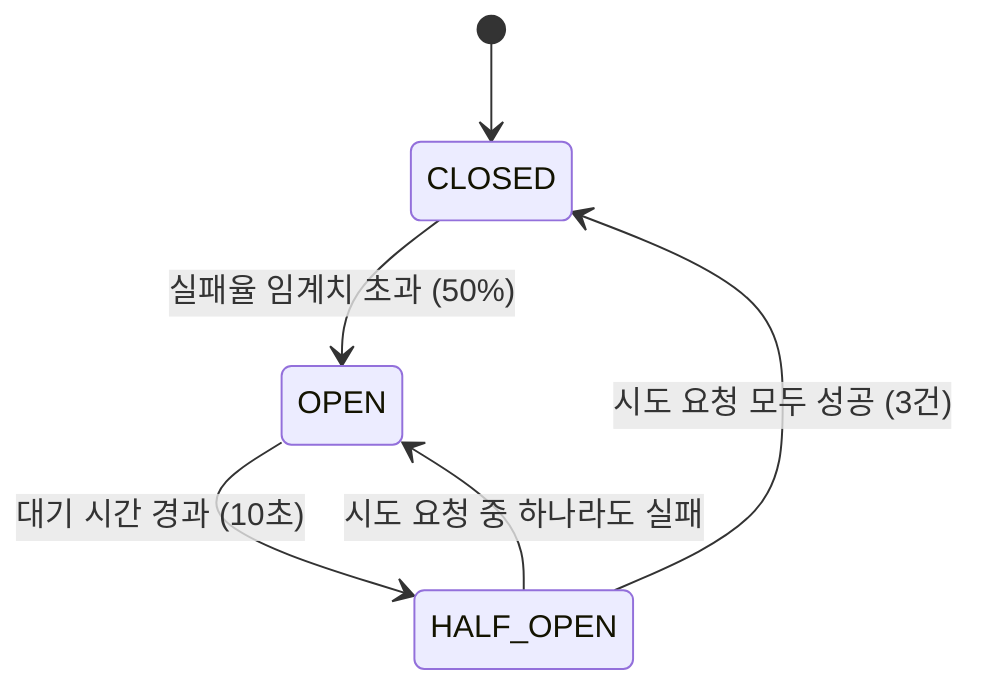
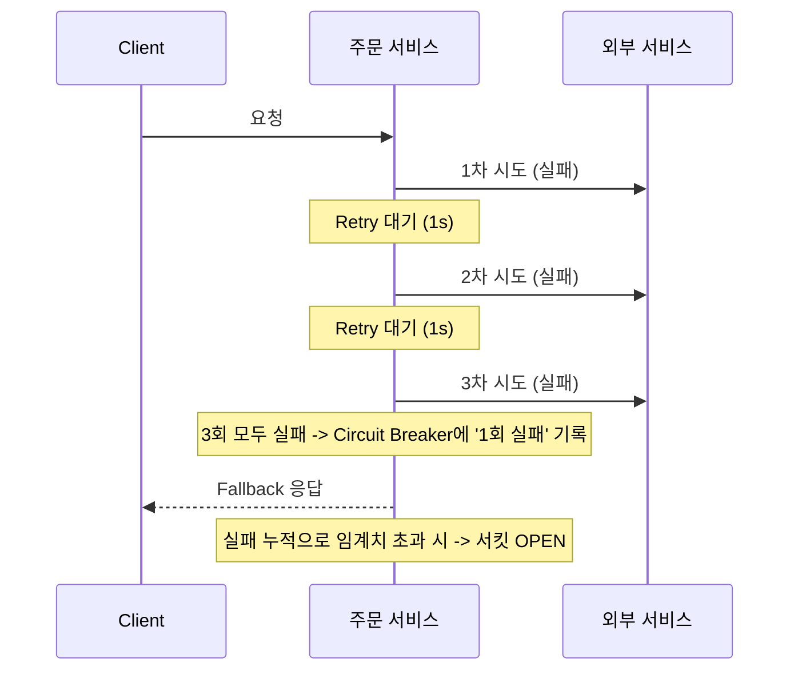

# 장애 전파 차단과 회복력 확보 전략 (Resilience4j)

> 외부 서비스가 죽었을 때, 우리 서비스까지 같이 죽지 않으려면 어떻게 해야 하는가?

---

## 목차
1. [배경 및 문제 정의](#1-배경-및-문제-정의)
2. [기술 선정: Resilience4j](#2-기술-선정-resilience4j)
3. [Circuit Breaker 설정 전략](#3-circuit-breaker-설정-전략)
4. [Retry와 Circuit Breaker의 공존](#4-retry와-circuit-breaker의-공존)
5. [운영적 한계 및 고도화 방향](#5-운영적-한계-및-고도화-방향)

---

## 1. 배경 및 문제 정의

### 1.1. 장애 전파 (Fault Propagation)
MSA 환경에서 주문 서비스는 `도서`, `쿠폰`, `회원` 서비스와 **OpenFeign 기반의 HTTP 동기 통신**을 수행함. 만약 도서 서비스에 장애가 발생하여 응답이 지연된다면?
1.  주문 서비스의 스레드가 응답을 기다리며 **블로킹(Blocking)** 됨.
2.  요청이 쌓이면서 주문 서비스의 **스레드 풀(Thread Pool)이 고갈**됨.
3.  결국 주문 서비스 전체가 마비되는 **연쇄 장애(Cascading Failure)** 로 이어짐.

### 1.2. 빠른 실패 (Fail-Fast)
장애가 난 서비스에 계속 요청을 보내는 것은 무의미하며 리소스 낭비임.
빠르게 실패 처리하고(Fail Fast), 대체 로직(Fallback)을 수행하거나 에러를 반환하여 시스템 전체를 보호해야 함.

---

## 2. 기술 선정: Resilience4j

과거에는 Netflix Hystrix가 표준이었으나, 현재는 유지보수 모드(Deprecated)로 전환되어, **Resilience4j** 가 Spring Boot 환경의 표준으로 자리 잡음.

*   **경량성:** 불필요한 의존성이 적고 가벼움.
*   **함수형:** Java 8 함수형 프로그래밍 스타일 지원.
*   **유연성:** CircuitBreaker, RateLimiter, Retry 등을 모듈별로 선택 사용 가능.

---

## 3. Circuit Breaker 설정 전략

### 3.1. 슬라이딩 윈도우 전략 (Window Strategy)
서킷 브레이커의 판단 기준이 되는 슬라이딩 윈도우 방식은 트래픽 패턴과 환경에 따라 전략적으로 선택해야 함.

*   **현재 (개발/테스트): 개수 기반 (Count-based)**
    *   **이유:** 트래픽이 적은 개발 환경에서도 적은 요청만으로 서킷의 동작(Open/Close)을 즉각적으로 검증하기 위해 채택함.
*   **향후 (운영): 시간 기반 (Time-based) 고려**
    *   **이유:** 대규모 트래픽 환경에서는 순간적인 오류 스파이크에 과민 반응하지 않고, 일정 시간 동안의 전체적인 장애 경향성을 판단하여 시스템 안정성을 높이는 것이 유리함.

### 3.2. 상태 전이 및 핵심 설정
서킷 브레이커는 3가지 상태를 오가며 동작함.



*   **CLOSED (정상):** 평소 상태. 요청을 정상적으로 통과시킴.
*   **OPEN (차단):** 장애 감지. 요청을 즉시 차단하고 에러 반환.
*   **HALF-OPEN (반 열림):** 일정 시간 후, 복구되었는지 확인하기 위해 소수의 요청만 허용.

#### 핵심 설정
*   **sliding-window-type:** 실패율을 계산할 방식 (개수 기반 / 시간 기반).
    *   `COUNT_BASED`: 최근 N개의 요청을 표본으로 삼음.
    *   `TIME_BASED`: 최근 N초 동안의 요청을 표본으로 삼음.
*   **failure-rate-threshold:** 서킷을 열기 위한 실패율 임계값 (%).
*   **sliding-window-size:** 실패율을 계산할 최근 요청의 표본 개수 (혹은 시간).
*   **wait-duration-in-open-state:** OPEN 상태에서 다시 HALF-OPEN으로 전환될 때까지의 대기 시간.
*   **permitted-calls-in-half-open:** HALF-OPEN 상태에서 복구 여부를 판단하기 위해 허용할 요청 수.

### 3.3. 주요 설정값 (Configuration)
아래의 설정값들은 **Spring Cloud Config** 서버를 통해 중앙 집중식으로 관리됨. 이를 통해 트래픽 변화나 외부 서비스 상태에 따라 애플리케이션의 재배포 없이 실시간으로 임계값이나 대기 시간을 조정할 수 있는 운영의 유연성을 확보함.

| 설정 항목 | 설정값 | 설정 논리 및 의도 (Rationale) |
| :--- | :--- | :--- |
| **failure-rate-threshold** | `50%` | 너무 낮으면 과민 반응하고, 너무 높으면 장애 대응이 늦어짐. 안정성과 민감도의 중간 지점으로 설정. |
| **sliding-window-size** | `10` | **개수 기반 (Count-based):** 운영 환경에서는 `100` 이상이 권장되나, 현재는 적은 트래픽에서도 서킷 동작을 빠르게 테스트하기 위해 표본 크기를 작게 잡음. |
| **wait-duration-in-open-state** | `10s` | 외부 서비스가 일시적 장애에서 스스로 복구될 수 있도록 충분한 시간을 주면서도, 사용자 대기 시간을 고려한 현실적인 값. |
| **permitted-calls-in-half-open** | `3` | 1회는 우연일 수 있고 10회는 부담이 됨. 통계적으로 유의미하면서도 시스템에 무리를 주지 않는 최소한의 횟수로 설정. |

---

### 3.4. 대체 로직(Fallback) 구현
서킷이 열려 있거나 외부 서비스 장애가 발생했을 때, 시스템은 즉시 예외를 던지는 대신 미리 정의된 **Fallback 메서드**를 호출하여 연쇄 장애를 차단함.

```java
// 1. 공통 핸들러 (ResilienceFallbackHandler.java)
public <T> T handle(String serviceName, String operationName, Throwable throwable) {
    if (throwable instanceof CallNotPermittedException) {
        log.warn("[{}] 서킷 열림 - {}", serviceName, operationName);
    } else {
        log.error("[{}] 요청 실패 - {}", serviceName, operationName);
    }
    // 일관된 예외로 변환하여 상위 레이어(ControllerAdvice)로 전달
    throw new ExternalServiceException(serviceName + " 오류: " + operationName, throwable);
}
```

#### 최종 에러 응답 (Error Response)
`GlobalExceptionHandler`를 통해 최종적으로 사용자에게는 다음과 같은 통일된 규격의 에러 메시지가 반환됨. 이를 통해 클라이언트는 장애 상황을 명확히 인지할 수 있음.

```json
{
  "message": "주문 생성 실패...",
  "errorCode": "SERVICE_UNAVAILABLE",
  "timestamp": "2026-..."
}
```

---

## 4. Retry + Circuit Breaker

단순한 네트워크 깜빡임에도 서킷이 열리는 것을 막기 위해 **Retry(재시도)** 패턴을 함께 사용함.

### 4.1. 적용 순서
**`Retry` -> `Circuit Breaker`** 순서로 동작함.



1.  요청 실패 시, 먼저 `Retry` 설정에 따라 3회까지 재시도함.
2.  3회 모두 실패하면 그때 비로소 `Circuit Breaker`에 "실패 1회"로 기록됨.
3.  이런 실패가 쌓여 임계치(50%)를 넘으면 서킷이 열림.

> **Retry와 멱등성(Idempotency)의 필수성**
> 네트워크 타임아웃 등으로 인해 요청 성공 여부를 알 수 없는 상태에서 `Retry`가 수행될 경우, 동일한 요청이 중복 처리될 수 있음. 또한 추후 스케줄러에 의한 사가 보정 시에도 중복 호출이 발생하므로, 모든 외부 서비스의 API는 반드시 **멱등성(Idempotency)** 이 보장되어야 함.

### 4.2. Retry 설정
*   **max-attempts:** `3` (최초 1회 + 재시도 2회)
*   **wait-duration:** `1s` (재시도 사이 1초 대기)
*   **대상 예외:** `IOException`, `TimeoutException` 등 일시적 장애만 재시도. (4xx 에러 등 비즈니스 예외는 재시도 안 함)

---

## 5. 운영적 한계 및 고도화 방향

### 5.1. 동기 호출 환경에서의 재시도 비용 누적
*   **문제점:** 현재 주문 서비스는 **동기(Synchronous)** 방식으로 동작하므로, `Retry` 횟수가 늘어날수록 해당 요청을 처리하는 스레드의 블로킹 시간이 선형적으로 증가함. 이는 트래픽 폭주 시 사용자 경험을 저하시키고 스레드 풀 고갈을 가속화할 수 있음.
*   **개선 방향:** 주문 서비스 로직을 비동기로 전환하는 것을 고려해야 함. 재고 선점을 제외한 후속 작업은 **비동기 메시징** 기반으로 전환하여 블로킹 시간을 최소화하고 시스템 처리량을 확보해야 함.

### 5.2. 모니터링 시스템 부재
*   **문제점:** 현재 서킷의 상태 변화(Open/Close)나 실패율 추이를 로그로만 확인 가능하여 실시간 대응이 어려움.
*   **개선 방향:** **Prometheus + Grafana** 대시보드를 연동하여 서킷 상태와 실패 지표를 시각화하고, 특정 임계치 초과 시 즉각적인 알림(Alerting)을 받을 수 있는 환경을 구축해야 함.
