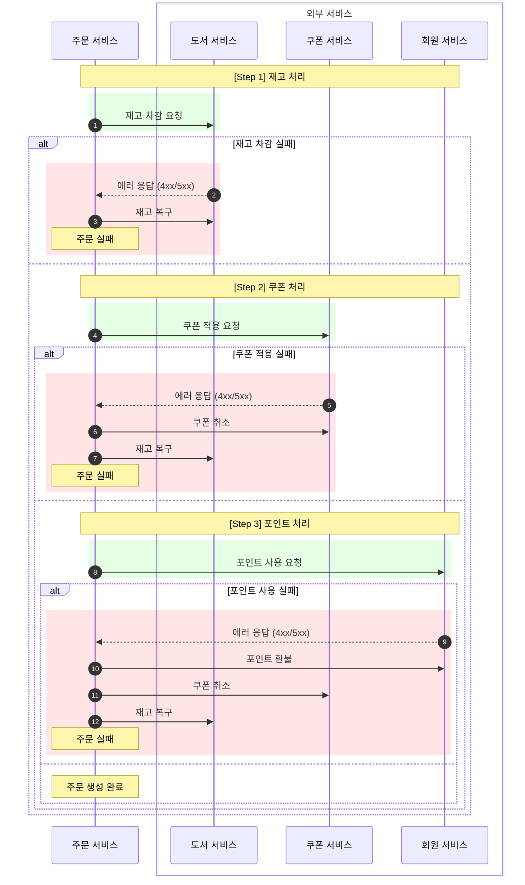
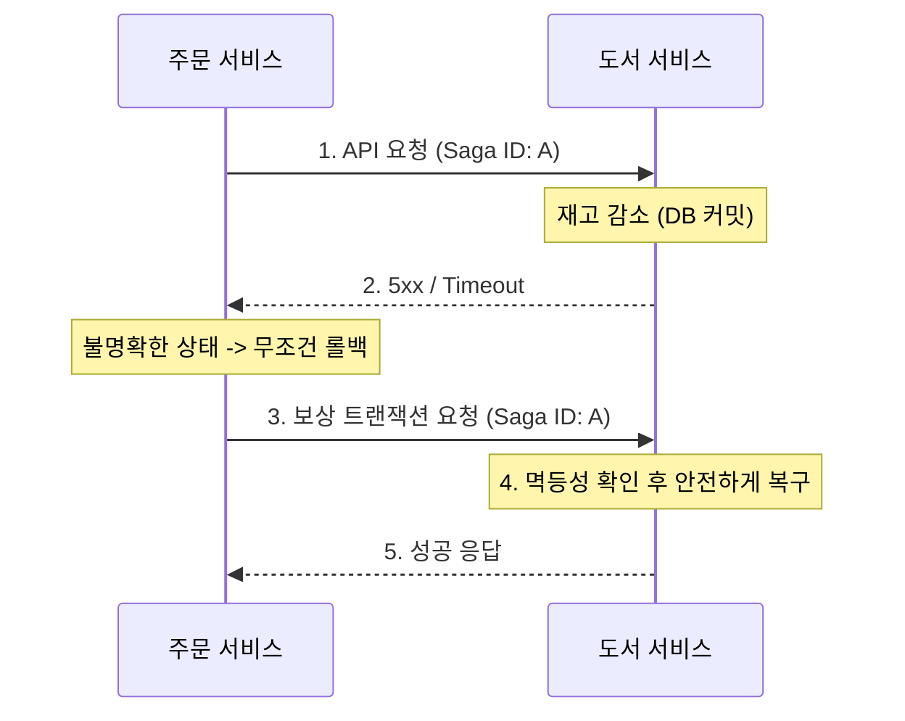
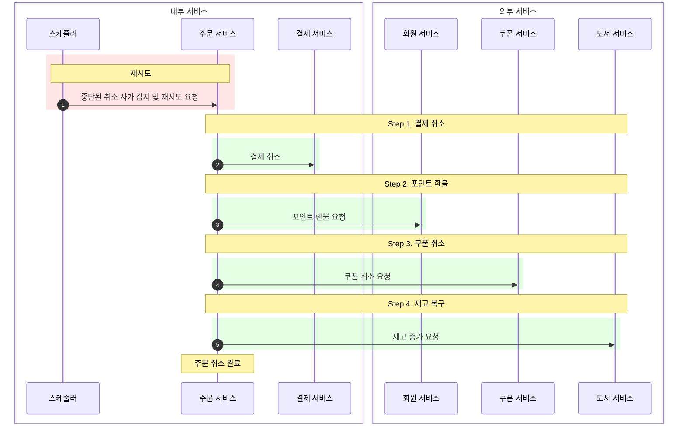

# 분산 트랜잭션 구현과 5xx 에러 처리 전략

> 단일 데이터베이스가 아닌 MSA 환경에서 어떻게 데이터 정합성(Data Consistency)을 보장할 것인가?

---

## 목차
1. [배경 및 문제 정의](#1-배경-및-문제-정의)
2. [아키텍처 결정: Orchestration Saga](#2-아키텍처-결정-orchestration-saga)
3. [Saga 처리 전략의 이원화](#3-saga-처리-전략의-이원화)
4. [주문 생성 사가 (OrderCreateSaga)](#4-주문-생성-사가-ordercreatesaga)
5. [5xx 에러와 멱등성 보장 전략](#5-5xx-에러와-멱등성-보장-전략)
6. [주문 취소 사가 (OrderCancelSaga)](#6-주문-취소-사가-ordercancelsaga)
7. [운영적 한계 및 고도화 방향](#7-운영적-한계-및-고도화-방향)

---

## 1. 배경 및 문제 정의

### 1.1. MSA와 Database per Service
모놀리식(Monolithic) 아키텍처에서는 모든 데이터가 단일 데이터베이스에 존재하므로, DBMS가 제공하는 ACID 트랜잭션(`@Transactional`) 하나로 강력한 데이터 일관성을 보장할 수 있었음.
하지만 마이크로서비스 아키텍처(MSA)를 도입하고 **Database per Service** 패턴을 적용함에 따라, 주문 로직이 여러 서비스(`Order`, `Book`, `Coupon`, `Member`)와 데이터베이스에 걸쳐 실행되는 상황이 됨.

### 1.2. 2PC (Two-Phase Commit)의 한계
**2PC(Two-Phase Commit)** 란 분산 환경의 모든 노드가 트랜잭션을 커밋할 준비가 되었는지 확인하는 **준비(Prepare)** 단계와, 실제로 커밋을 수행하는 **커밋(Commit)** 단계로 나누어 처리하는 합의 알고리즘임. 데이터의 **강한 일관성(Strong Consistency)** 을 보장한다는 장점이 있지만, 다음과 같은 이유로 본 프로젝트에서 배제함.

*   **성능 저하:** 모든 참여자가 준비될 때까지 락(Lock)을 유지해야 하므로 처리량이 급격히 저하됨.
*   **가용성 문제:** 코디네이터나 참여자 중 하나라도 응답하지 않으면 전체 시스템이 블로킹될 위험이 있음.

따라서 주문 서비스에 **Saga Pattern**을 도입하여, 각 로컬 트랜잭션을 순차적으로 실행하고 실패 시 **보상 트랜잭션(Compensating Transaction)** 을 통해 데이터의 **결과적 일관성(Eventual Consistency)** 을 보장하는 전략을 선택함.

---

## 2. 아키텍처 결정: Orchestration Saga

**Saga Pattern이란?** 분산 시스템에서 긴 트랜잭션을 여러 개의 짧은 로컬 트랜잭션으로 나누어 순차적으로 실행하고, 중간에 실패 시 이전 단계들을 취소하는 **보상 트랜잭션(Compensating Transaction)** 을 실행하여 데이터 정합성을 맞추는 패턴임.

Saga 패턴을 구현하는 방식에는 크게 **Choreography(안무)** 와 **Orchestration(지휘)** 두 가지가 있으며, 본 프로젝트는 **Orchestration** 방식을 채택함.

| 비교 항목       | Choreography (안무)       | Orchestration (지휘) |
|:------------|:------------------------| :--- |
| **제어 방식**   | 서비스 간 이벤트 구독/발행         | 중앙 조정자가 명령/응답 제어 |
| **주요 장점**   | 서비스 간 결합도가 낮고 독립적 확장 용이 | **비즈니스 흐름 가시성이 높고 상태 관리 용이** |
| **주요 단점**   | 전체 흐름 파악 및 문제 해결이 어려움   | 오케스트레이터에 대한 의존성 및 복잡도 발생 |
| **데이터 정합성** | 이벤트 추적을 통해 간접적으로 파악     | **중앙에서 즉각적인 정합성 확인 가능** |
| **적합한 상황**  | 흐름이 단순하고 참여자가 적을 때      | **비즈니스 로직이 복잡하고 단계가 많을 때** |

### 2.1. OpenFeign 기반 동기(Synchronous) 방식 선택 이유
본 프로젝트는 비동기 메시징(RabbitMQ 등) 대신 **OpenFeign 기반의 HTTP 동기식 오케스트레이션 Saga**를 채택함.

*   **사용자 경험(UX) 관점**
    *   사용자는 "주문하기" 버튼을 누른 즉시 다른 페이지로 이탈하기보다 성공/실패 여부에 대한 확정적인 결과를 기대함.
    *   비동기 방식에서 발생하는 "일단 접수 후 나중에 재고 부족으로 취소 알림"과 같은 부정적 경험을 방지함.
*   **구현 관점**
    *   코드의 흐름이 직관적이라 비즈니스 로직의 정합성을 검증하고 디버깅하기 용이함.
    *   첫 분산 트랜잭션 설계이자 첫 MSA 프로젝트로서 데이터 정합성 보장에 추가로 메시지 브로커 운영, Outbox Pattern, 메시지 중복, 메시지 순서 보장, DLQ 설계와 같은 인프라 및 운영 복잡도까지 감당하는 것은 리스크가 크다고 판단함.
*   **한계점**
    *   외부 서비스 응답을 기다리는 동안 요청 스레드가 블로킹되어 동시 요청이 증가하면 스레드 풀이 고갈되어 대기 시간이 폭증할 수 있음.
    *   `도서 서비스` 등 외부 서비스의 장애가 주문 서비스 전체 응답 지연 또는 실패로 전파될 수 있음. (이는 Resilience4j CircuitBreaker를 통해 완화함)
*   **결론**
    * **처리량(Throughput)** 을 일부 희생하더라도 **사용자 경험(UX)** 을 우선하며, Saga Pattern의 핵심 개념(상태 관리, 보상 트랜잭션, 멱등성, 장애 복구)을 명확히 구현하고 데이터 정합성을 보장하는 것을 우선시한 결정임.

### 2.2. Saga의 역할
*   **트랜잭션 조율:** 각 단계별로 외부 서비스(Feign Client)를 호출함.
*   **상태 관리:** `SagaStep` Enum을 통해 현재 진행 단계를 DB에 기록함.
*   **보상/재시도 처리:** 실패 감지 시, 기록된 상태를 역추적하여 필요한 보상 트랜잭션을 실행하거나, 스케줄러로 재시도 처리.

### 2.3. Saga 엔티티 구조
Saga 패턴을 안정적으로 구현하기 위해, 시스템은 각 트랜잭션의 상태를 다음과 같은 구조로 관리함.

```java
// OrderSaga.java (공통 부모 클래스)
public abstract class OrderSaga extends BaseTimeEntity {
    @Id
    private UUID sagaId;          // 멱등성 키 및 트랜잭션 고유 식별자

    private Long orderId;         // 보상 트랜잭션 대상 식별 (초기 저장된 주문 ID)

    private SagaStatus overallStatus; // 사가 전체 상태 (PROGRESS, COMPLETED, FAILED 등)

    private boolean bridged = false;  // 도메인 상태(Order)와의 최종 동기화 여부
}

// OrderCreateSaga.java (주문 생성 구현체)
public class OrderCreateSaga extends OrderSaga {
    private CreateSagaStep lastCompletedStep; // 마지막으로 성공한 단계 (체크포인트)
}
```

## 3. Saga 처리 전략의 이원화

본 프로젝트는 **주문 생성**과 **주문 취소**라는 두 가지 비즈니스 시나리오의 성격이 본질적으로 다르다는 점에 주목하여, 각각 다른 Saga 처리 전략을 적용함.

*   **주문 생성 (Order Creation):** 고객의 요청이 아직 처리 중인 단계. 재고 부족이나 결제 실패 등 예외가 발생하면, 즉시 모든 변경 사항을 원복(Rollback)하고 고객에게 실패를 알려야 함.
*   **주문 취소 (Order Cancellation):** 고객의 취소 요청이 이미 시스템에 접수된 단계. 내부 시스템의 일시적인 오류로 처리가 지연되더라도, 시스템은 끝까지 책임을 지고 취소를 완료해야 함.

이러한 비즈니스적 차이를 반영하여 다음과 같이 처리 전략을 이원화함.

### 3.1. 생성(Creation) vs 취소(Cancellation)

| 구분 | 주문 생성 Saga (OrderCreateSaga)        | 주문 취소 Saga (OrderCancelSaga) |
| :--- |:------------------------------------|:----------------------------------|
| **목표** | 원자적 생성 보장 (All or Nothing)          | 최종적인 취소 보장           |
| **복구 전략** | **롤백 (Rollback)** | **재시도 (Retry)**         |
| **실패 시** | 역순으로 Rollback 후 사용자에게 '실패' 응답             | 성공할 때까지 스케줄러가 무한 재시도              |
| **상태 관리** | `-ing`(요청 중) 상태 필요 (어디서 멈췄는지 정밀 추적) | 완료된 체크포인트(`-ed`)만 관리 (멱등성 기반 재시도) |

### 3.2. 왜 취소는 롤백(Rollback)하지 않는가?
주문 취소 프로세스에서 롤백을 수행하지 않고 **재시도(Retry)** 전략을 택한 이유는 다음과 같음.

1.  **비즈니스적 모순:** 고객은 이미 "주문 취소"를 요청했는데, 시스템 오류로 취소가 실패했다고 해서 다시 "주문 취소를 취소"하는 것은 고객 의도에 반하는 이상한 비즈니스 로직임.
2.  **데이터 불일치 위험:** 만약 `재고 증가`를 시도하다 실패해서 롤백(재고 다시 감소)을 하려는데, 그 사이에 다른 사용자가 남은 재고를 구매하여 재고가 0이 되었다면? 롤백조차 불가능한 심각한 데이터 불일치에 빠지게 됨.

### 3.3. 상태 관리의 차이점
위와 같은 전략 차이로 인해 상태 관리 방식도 달라짐.

특히 **주문 생성 Saga**에서는 `STOCK_DECREASING` 같은 **진행 중(-ing)** 상태를 별도로 관리함.

*   **문제 상황:** 만약 `-ing` 상태 없이 요청을 보낸다면?
    1.  `재고 차감 API` 호출 (성공)
    2.  응답을 받고 DB에 `재고 차감 완료` 기록하려는 순간 **서버 다운**
    3.  재부팅 후 DB 확인 시 상태는 여전히 `STARTED`(시작 전)
    4.  결과: 재고는 빠졌는데 시스템은 시도조차 안 한 것으로 인지하여 **재고 누락** 발생.
*   **해결:** 요청을 보내기 **직전**에 `-ing` 상태를 먼저 기록함.
    *   재부팅 후 `-ing` 상태가 남아있다면 "시도는 했으나 결과는 모르는 상태"로 판단하여 무조건 **보상 트랜잭션**을 수행할 수 있음.

반면, **주문 취소 Saga**에서는 `-ing` 상태를 관리하지 않음.
*   취소 전략은 **재시도(Retry)** 이므로, "어디서 멈췄는지"를 정밀하게 추적할 비용을 들일 필요 없이, **"어디까지 성공했는지(Checkpoint)"** 만 관리하면 충분함.

### 3.4. 스케줄러를 통한 최종 동기화 정책
서버 장애로 인해 사가가 중단되거나, 사가가 완료되었으나 도메인에 반영이 되지 않은 경우, 스케줄러의 복구 정책은 비즈니스 특성에 따라 다음과 같이 나뉨.

| 구분          | 주문 생성 (Creation) | 주문 취소 (Cancellation) |
|:------------| :--- | :--- |
| **스케줄러 동작** | **무조건 롤백 (Compensate)** | **무조건 재시도 (Retry)** |
| **판단 근거**   | **실시간성 중요:** 지연된 주문은 사용자가 이미 이탈했을 확률이 높으므로, 유령 주문을 살리기보다 재고를 빠르게 반환하는 것이 유리함. | **취소의 불가역성:** "취소를 취소"할 수 없으므로, 시스템이 복구될 때까지 계속 시도하여 반드시 성공시켜야 함. |


---

## 4. 주문 생성 사가 (OrderCreateSaga)

### 4.1. 주문 생성 전체 프로세스
주문 생성은 다음과 같은 순서로 진행되며, 각 단계는 데이터 정합성을 지키기 위해 설계됨.

1.  **초기 주문 저장 (`OrderInitialCreateService`):** 주문 정보를 DB에 먼저 저장함 (상태: `CREATING`).
2.  **사가 시작:** 고유한 Saga ID를 발급하고 사가 인스턴스를 생성함.
3.  **오케스트레이션 실행:** 재고 -> 쿠폰 -> 포인트 순으로 외부 API를 호출함 (실패 시 즉시 롤백).
4.  **최종 도메인 반영 (`OrderFinalizerCreateService`):** 사가가 성공하면 주문 상태를 `PENDING`(결제 대기)으로 변경함.
5.  **브릿징 완료:** 사가와 도메인 상태가 완전히 동기화되었음을 표시함 (`bridged = true`).

### 4.2. 초기 주문 저장의 이유
사가를 시작하기 전에 주문 엔티티를 먼저 DB에 저장하는 이유는 **장애 복구의 대상** 을 명확히 하기 위함임.

*   **문제 상황:** 만약 주문 저장 없이 외부 API 호출(사가)부터 시작했는데 서버가 다운되면, 재부팅 후 어떤 주문이 진행 중이었는지 알 수 없어 보상 트랜잭션(롤백) 자체가 불가능해짐.
*   **해결:** `CREATING` 상태의 주문을 먼저 저장해둠으로써, 서버가 재시작되었을 때 스케줄러가 "아직 완료되지 않은 주문"을 찾아내어 안전하게 보상 트랜잭션(롤백)을 수행할 수 있는 근거를 마련함.

### 4.3. 진행 상태(-ing) 선기록 구현
주문 생성 오케스트레이터는 외부 서비스를 호출하기 **직전**에 상태를 먼저 DB에 기록함. 이는 장애 발생 시 "어디까지 시도했는지"를 정확히 추적하기 위함임.

```java
// OrderCreateOrchestrator.java
try {
    // 1. 상태 먼저 업데이트 (선기록)
    sagaUpdateService.updateCreateSagaStep(saga, CreateSagaStep.STOCK_DECREASING);
    
    // 2. 외부 API 호출 (사가 ID를 함께 넘겨줘서 멱등성 보장)
    bookService.decreaseStocks(saga.getSagaId(), quantityMap);
    
    // 1번 단계가 없다면, 여기서 주문 서버가 다운될 시 도서 재고가 감소되었음에도, 사가의 상태는 여전히 STARTED 상태
    // 역순으로 보상 트랜잭션을 시도해도 재고가 복구되지 않음. -> -ing 상태 도입
    
    // 3. 성공 시 다음 상태 기록
    sagaUpdateService.updateCreateSagaStep(saga, CreateSagaStep.STOCK_DECREASED);
    
    // ... 반복
} catch (Exception e) {
    compensate(saga, order); // 실패 시 역순 보상 트랜잭션
}
```

### 4.4. 사가 상태 단계 및 프로세스
트랜잭션의 각 단계는 `CreateSagaStep`으로 관리되며, 성공 여부에 따라 상태가 전이됨.

| 단계 | 상태 Enum | 설명 |
| --- | --- | --- |
| 1 | `STARTED` | 사가 시작 |
| 2 | `STOCK_DECREASING` | 재고 차감 요청 중 |
| 3 | `STOCK_DECREASED` | 재고 차감 완료 |
| 4 | `COUPON_APPLYING` | 쿠폰 적용 요청 중 |
| 5 | `COUPON_APPLIED` | 쿠폰 적용 완료 |
| 6 | `POINT_USING` | 포인트 사용 요청 중 |
| 7 | `POINT_USED` | 포인트 사용 완료 |



## 5. 5xx 에러와 멱등성 보장 전략
분산 시스템에서 가장 다루기 까다로운 문제는 외부 서비스 호출 시 발생하는 **Timeout**이나 **5xx (Internal Server Error)** 임.

### 5.1. 불확실한 상태
ex) `도서 서비스`에 `재고 감소` 요청을 보냈는데 5xx 에러가 오거나 응답이 오지 않는 경우(Timeout), 클라이언트는 **재고 감소가 성공했지만, 응답을 받지 못한 것인지**, 아니면 **재고가 감소되지 않은 것인지** 알 수 없음.




### 5.2. 해결책: 무조건적인 보상 트랜잭션 수행
이러한 불확실성을 해결하기 위해, **요청이 실패하면(4xx, 5xx 모두) 무조건 보상 트랜잭션(Rollback)을 수행**하는 복구 전략을 채택함.

*   혹시라도 처리되었을지 모르는 데이터를 남겨두는 것보다, 확실하게 취소를 요청하여 정합성을 맞추는 것이 안전하다고 판단함.

> **보상 트랜잭션(Rollback)조차 실패한다면?**
> 네트워크 완전 단절 등의 이유로 보상 트랜잭션 요청까지 실패할 수 있음. 이 경우 사가 상태는 여전히 완료되지 않은 상태로 남게 되며, 별도의 **복구 스케줄러(Reconciliation Scheduler)** 가 주기적으로 이를 감지하여 보상 트랜잭션을 재시도함.

### 5.3. 멱등성(Idempotency) 구현 패턴
모든 참여 서비스는 중복 요청에도 안전해야 하며, 본 프로젝트는 두 가지 방식으로 이를 달성함.

1.  **Unique Key (Saga ID) 방식:**
    *   도서(Book), 회원(Member) 서비스는 요청 시 전달받은 `Saga ID`를 DB에 기록하여 중복 처리를 방지함.

```java
    // BookService.java (도서 서비스)
    
    // 주문 생성 - 재고 감소 로직
    @Transactional
    public void decreaseStock(UUID sagaId, Map<Long, Integer> quantityMap) {
        // 멱등성 키 생성
        OrderBookSagaLogId sagaLogId = new OrderBookSagaLogId(sagaId, OrderSagaType.DECREASE_STOCK);
    
        // 1. 이미 처리된 작업이라면 무시하고 성공 리턴 (멱등성 보장)
        if (orderBookSagaLogRepository.existsById(sagaLogId)) {
            return;
        }
    
        // 2. 실제 비즈니스 로직 (재고 차감)
        orderBookRepository.decreaseStock(quantityMap);
    
        // 3. 처리 완료 기록 저장
        orderBookSagaLogRepository.save(new OrderBookSagaLog(sagaLogId));
    }
    
    // 주문 생성 실패 - 재고 복구 로직 (보상 트랜잭션)
    // 오케스트레이터가 "-ing" 상태만 보고 롤백을 요청했을 때, 실제로 차감된 적이 없다면 재고를 늘리면 안 됨.
    @Transactional
    public void rollbackStock(UUID sagaId, Map<Long, Integer> quantityMap) {
        OrderBookSagaLogId sagaLogId = new OrderBookSagaLogId(sagaId, OrderSagaType.ROLLBACK_STOCK);
    
        // 1. 이미 롤백 처리된 작업이라면 패스
        if (orderBookSagaLogRepository.existsById(sagaLogId)) {
            return;
        }
    
        // 2. 해당 사가로 '재고 감소'를 수행한 적이 있는지 확인
        boolean hasDecreased = orderBookSagaLogRepository.existsById(
            new OrderBookSagaLogId(sagaId, OrderSagaType.DECREASE_STOCK)
        );
    
        // 3. 감소한 적이 없다면, 무시하고 성공 리턴 (감소되지 않았는데 증가되면 안 됨)
        if (!hasDecreased) {
            return;
        }
        
        // 4. 실제 비즈니스 로직 (재고 증가)
        orderBookRepository.increaseStock(quantityMap);
        
        // 5. 처리 완료 기록 저장
        orderBookSagaLogRepository.save(new OrderBookSagaLog(sagaLogId));
    }
```

2.  **상태 기반(State-based) 방식:**
    *   쿠폰(Coupon) 서비스와 같이 상태가 단순한(`사용`/`미사용`) 경우, 특정 상태로의 업데이트(e.g., `is_used = true`) 연산을 통해 자연스럽게 멱등성을 보장함. 이미 해당 상태인 경우 무시하고 성공을 반환함.

---

## 6. 주문 취소 사가 (OrderCancelSaga)

### 6.1. 사가 상태 단계

| 단계 | 상태 Enum           | 설명           |
| --- |-------------------|--------------|
| 1 | `STARTED`         | 사가 시작        |
| 2 | `PAYMENT_CANCELED` | 결제 취소        |
| 3 | `POINT_REFUNDED`  | 포인트 반환       |
| 4 | `COUPON_RESTORED` | 쿠폰 취소        |
| 5 | `STOCK_INCREASED` | 재고 증가        |

### 6.2. 사가 프로세스

주문 취소 사가는 실패 시 보상 트랜잭션(롤백)이 아닌, **스케줄러에 의해 성공할 때까지 재시도**됨.



### 6.3. 재시도 (Retry) 구현
주문 생성 사가가 실패 시점부터 **역순으로 회수(Rollback)** 하는 반면, 취소 사가는 스케줄러로부터 **마지막 성공 지점(Checkpoint)** 부터 **정순으로 재개(Retry)** 하여 작업을 완료함.

```java
// OrderCancelOrchestrator.java

// 스케줄러가 실행하는 재시도 로직
public void retry(OrderCancelSaga saga, Order order) {
    // 1. DB에 저장된 마지막 성공 단계(Checkpoint) 조회
    CancelSagaStep currentStep = saga.getLastCompletedStep();

    // 2. 결제 취소 (아직 안 된 경우에만 실행)
    if (currentStep.ordinal() < CancelSagaStep.PAYMENT_CANCELED.ordinal()) {
        paymentFlowService.cancelPaymentByMember(...);
        // 성공 시 체크포인트 저장
        sagaUpdateService.updateCancelSagaStep(saga, CancelSagaStep.PAYMENT_CANCELED);
    }
    
    // 3. 포인트 환불 (아직 안 된 경우에만 실행)
    if (currentStep.ordinal() < CancelSagaStep.POINT_REFUNDED.ordinal()) {
         memberService.increasePoint(...);
         sagaUpdateService.updateCancelSagaStep(saga, CancelSagaStep.POINT_REFUNDED);
    }

    // ... (모든 단계가 완료될 때까지 스케줄러가 주기적으로 호출)
}
```
---

## 7. 운영적 한계 및 고도화 방향

### 7.1. 동기 호출(Blocking I/O)의 처리량 한계
*   **문제점:** 외부 서비스 응답을 기다리는 동안 요청 스레드가 블로킹되므로, 트래픽 폭주 시 스레드 풀이 고갈되어 시스템 전체 처리량이 제한될 수 있음.
*   **개선 방향:** **하이브리드 아키텍처** 도입을 고려할 수 있음.
    *   **재고 선점:** UX 보장(확정적 응답)을 위해 **동기(Sync)** 방식 유지.
    *   **후속 작업(쿠폰/포인트/결제):** Kafka 등을 활용한 **비동기(Async)** 처리로 전환하여 응답 속도를 단축하고 시스템 처리량을 극대화함.

### 7.2. Saga 로그 데이터의 증가
*   **문제점:** 모든 트랜잭션의 단계별 상태 변경 로그를 DB에 저장하므로, 서비스 운영 기간이 길어질수록 테이블 크기가 비대해져 조회 성능이 저하될 우려가 있음.
*   **개선 방향:** 완료된(`COMPLETED`) 데이터는 별도의 History 테이블로 **이관(Archiving)** 하거나, 날짜 기반의 **파티셔닝(Partitioning)** 전략을 적용하여 운영 테이블을 경량화해야 함.
    1. **아카이빙 전략**: Spring Batch를 활용하여 주기적으로 완료된 사가 데이터를 별도 테이블로 이동.
    2. **파티셔닝 전략**: 현재 사가 엔티티는 UUID를 PK로 사용하고 있어 생성 시간 기반 파티셔닝을 도입하려면, (UUID, createdAt) 형태의 복합키 설계 변경이 필요함. -> 복합키의 복잡성을 피하기 위한 TSID 기반 파티셔닝 전략 고려.

### 7.3. 트랜잭션 추적성 및 모니터링 강화
*   **현황:** 
    * Micrometer와 EFK 스택을 통해 시스템 로그 수집 및 에러 빈도 시각화는 구축됨.
    * 시스템 장애 발생 시, 장애 여부와 원인은 Dooray 알림을 통해 신속히 인지 가능.
*   **문제점:**
    * 개별 사가 트랜잭션의 전체 흐름(어떤 단계에서 실패했는지, 각 단계별 소요 시간 등)에 대한 가시성이 부족하여, 장애 원인 분석 및 성능 튜닝에 어려움이 있음.
*   **개선 방향:** 비즈니스 메트릭 수집 및 Grafana 대시보드 구축.
    1. 커스텀 메트릭 정의: 각 사가 단계별 성공/실패 카운터, 처리 시간 히스토그램 등.
    2. Grafana 대시보드 구성: 실시간 모니터링 및 장애 분석용 시각화 대시보드 구축.

