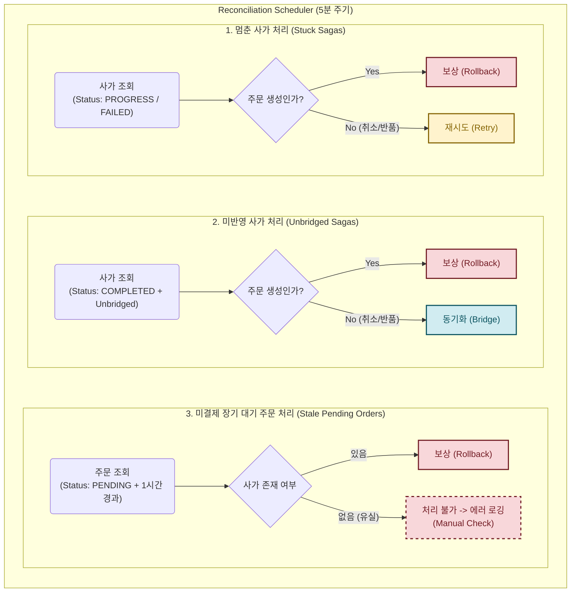
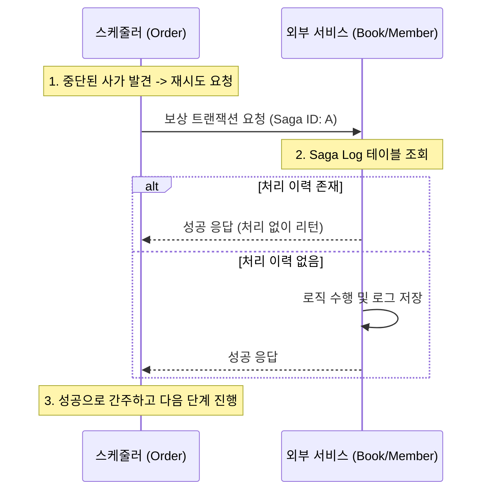

# 데이터 정합성 복구를 위한 스케줄링 전략

> 시스템 장애, 배포, 네트워크 단절 등으로 인해 중단된 분산 트랜잭션을 어떻게 처리할 것인가?

---

## 목차
1. [배경 및 문제 정의](#1-배경-및-문제-정의)
2. [아키텍처 결정: DB 조회 방식](#2-아키텍처-결정-db-조회-방식)
3. [복구(Reconciliation) 전략](#3-복구reconciliation-전략)
4. [안정성 확보 및 방어 설계](#4-안정성-확보-및-방어-설계-defensive-design)
5. [운영적 한계 및 고도화 방향](#5-운영적-한계-및-고도화-방향)

---

## 1. 배경 및 문제 정의

### 1.1. 분산 시스템의 불확실성
앞선 [Saga Pattern 문서](https://github.com/nhnacademy/order-api/wiki/Saga-Pattern)에서 설명했듯이, 주문 서비스는 Saga 패턴을 이용해 분산 트랜잭션을 관리함.
하지만 Saga Orchestrator가 메모리 상에서 로직을 수행하던 중 **서버가 비정상 종료(Crash)** 되거나 **배포(Restart)** 가 발생한다면 다음과 같은 문제가 발생함.

1.  **진행 중단:** `재고 차감`은 성공했으나, 다음 단계인 `쿠폰 사용`을 호출하기 직전에 주문 서버가 꺼짐. DB에는 여전히 `PROGRESS`(진행 중) 상태로 남아있음.
2.  **결과 유실:** 사가 트랜잭션은 모두 성공(`COMPLETED`)했으나, 최종적으로 주문 상태를 `PENDING`으로 변경하는 과정에서 에러가 발생하여 주문은 영원히 `CREATING` 상태로 남거나 흐름이 끊김.

이러한 **중단된 트랜잭션** 들은 스스로 복구되지 않으므로, 외부에서 주기적으로 상태를 검사하고 처리를 마무리해주는 **보정 스케줄러(Reconciliation Scheduler)** 가 필요함.

---

## 2. 아키텍처 결정: DB 조회 방식

### 2.1. 이벤트 발행 vs DB 조회
복구 메커니즘을 설계할 때, "실패를 어떻게 감지할 것인가?"에 대해 다음과 같이 비교함.

| 방식 | 이벤트 발행 (Event / DLQ) | DB 조회 |
| :--- | :--- | :--- |
| **동작** | 실패 시 메시지 큐나 `@EventListener`로 이벤트 발행 | 주기적으로 DB를 조회하여 멈춘 데이터를 찾음 |
| **장점** | 실시간성이 높고 DB 부하가 적음 | **구현이 단순하고, 메시지 유실 걱정이 없음** |
| **단점** | 서버 종료 시 **장애 시점의 상태 정보 전달이 불가능**할 수 있음 | 주기적인 DB 조회 쿼리 부하 발생 |

* 서버가 비정상적으로 종료되는 상황에서는 이벤트 발행 자체가 불가능할 수 있음. 따라서 **DB에 기록된 상태** 를 주기적으로 확인하는 방식이 가장 확실한 복구 수단이라고 판단함.

### 2.2. Spring Scheduler 활용 이유 (vs Batch Server)
|    | Spring Scheduler | Batch Server (Spring Batch) |
|:---| :--- | :--- |
| **작업 성격** | 주기적인 상태 체크 | 대용량 데이터 일괄 가공 |
| **인프라 복잡도** | **낮음** (기존 애플리케이션 내장) | **높음** (별도 서버 구축 및 배포 필요) |
| **응집도** | **높음** (도메인 로직과 함께 관리) | **낮음** (로직이 분산될 수 있음) |
*   대용량 데이터를 일괄 가공하는 배치(Batch) 작업이라기보다, 주기적으로 상태를 체크하는 작업에 가까움.
*   별도의 배치 서버를 구축하고 배포/운영하는 비용을 줄이고, 주문 도메인 로직을 가장 잘 아는 주문 서비스 내에서 처리하여 코드의 응집도를 높임.

### 2.3. 인프라 환경: 서버 이중화
*   단일 장애점을 제거하고 무중단 배포를 지원하기 위해 주문 서비스는 **다중 인스턴스** 로 구성됨.
*   별도의 제어 장치가 없다면, 5분마다 모든 인스턴스에서 동일한 스케줄러가 동시에 실행되어 **중복 보상** 이나 **리소스 낭비**가 발생할 위험이 있음.

### 2.4. 해결책: ShedLock 도입 (vs Redisson)
|            | ShedLock                                         | Redis / Redisson |
|:-----------|:-------------------------------------------------| :--- |
| **의존성**    | **기존 RDB 활용 (의존성 추가 없음)**                        | **별도 Redis 구축 필요** |
| **락 관리 방식** | DB 테이블 (`shedlock`) 행 삽입                         | 인메모리 Key-Value (TTL) |
| **주요 장점**  | 구현이 매우 단순하고 영속성이 보장됨                             | 성능이 빠르고 Pub/Sub 활용 가능 |
*   단순한 스케줄러 락 관리를 위해 별도의 Redis 클러스터를 구축하고 관리하는 것은 프로젝트 규모 대비 비효율적이라고 판단함.
*   이미 사용 중인 RDB를 활용하여 `shedlock` 테이블 하나만 추가하면 되므로, 새로운 인프라 의존성 없이 강력한 분산 락을 구현할 수 있음.
*   Redis의 데이터 휘발 가능성을 걱정할 필요 없이, RDB의 트랜잭션과 영속성을 그대로 활용함.

---

## 3. 복구(Reconciliation) 전략

### 3.1. 시나리오별 복구 정책

| 시나리오                | 대상 (Target) | 상태 (Status) | 동작 (Action) | 근거 (Rationale) |
|:--------------------| :--- | :--- | :--- | :--- |
| **주문 생성 중단**        | `OrderCreateSaga` | `PROGRESS` / `COMPENSATED` | **보상 (Rollback)** | 지연된 주문은 사용자가 이미 이탈했을 확률이 높음. 유령 주문을 살리기보다 재고를 즉시 반환하는 것이 비즈니스적으로 유리함. |
| **주문 취소 중단**        | `OrderCancelSaga` | `PROGRESS` / `FAILED` | **재시도 (Retry)** | 취소는 "취소의 취소"가 불가능한 최종 상태이므로, 성공할 때까지 끝까지 책임짐. |
| **주문 반품 중단**        | `OrderItemRefundSaga` | `PROGRESS` / `FAILED` | **재시도 (Retry)** | 관리자 승인 후 진행되는 프로세스 특성상 실시간성보다 정확한 처리가 더 중요함. 결과적 일관성 확보가 사용자 경험을 해치지 않는 영역임. |
| **도메인 미반영 (생성)**    | `OrderCreateSaga` | `COMPLETED` | **보상 (Rollback)** | 사가는 성공했으나 도메인 반영이 늦어진 경우에도, 실시간성 확보를 위해 전체 롤백 처리함. |
| **도메인 미반영 (취소/반품)** | `OrderCancelSaga` / `OrderItemRefundSaga` | `COMPLETED` | **재동기화 (Bridge)** | 사가가 성공했다면 도메인 상태를 그에 맞게 최종 동기화함. |
| **미결제 장기 대기 주문**    | `Order` | `PENDING` | **보상 (Rollback)** | 1시간 이상 결제가 진행되지 않은 주문은 자원 반환을 위해 정리함. |

### 3.2. 스마트 복구 메커니즘
스케줄러가 트리거하는 보정 로직은 처음부터 모든 작업을 다시 수행하지 않음. 사가 엔티티에 기록된 **마지막 성공 단계(`lastCompletedStep`)** 를 기반으로 필요한 작업만 선별적으로 수행하여 효율성을 높임.

```java
// OrderCreateOrchestrator.java (보상 트랜잭션 예시)
public void compensate(OrderCreateSaga saga, Order order) {
    // 1. 마지막으로 성공한 사가 단계 확인 (체크포인트)
    CreateSagaStep currentStep = saga.getLastCompletedStep();

    // 2. 포인트 단계까지 도달했었다면 포인트 롤백
    if (currentStep == CreateSagaStep.POINT_USING || currentStep == CreateSagaStep.POINT_USED) {
        memberService.rollbackPoint(...);
        currentStep = CreateSagaStep.COUPON_APPLIED; // 역순 진행
    }

    // 3. 쿠폰 단계까지 도달했었다면 쿠폰 롤백
    if (currentStep == CreateSagaStep.COUPON_APPLYING || currentStep == CreateSagaStep.COUPON_APPLIED) {
        couponService.withdrawCoupon(...);
        currentStep = CreateSagaStep.STOCK_DECREASED; // 역순 진행
    }
    
    // ... 이처럼 단계별 조건문을 통해 필요한 보상 트랜잭션만 수행
}
```

### 3.3. 사가 유실 문제
* 과거에는 주문 저장과 사가 생성이 분리된 트랜잭션으로 처리되어, 그 사이 서버 장애 시 **주문은 생성되었으나 사가는 없는** 문제가 발생할 수 있었음.
*   **해결책: `OrderInitialCreateService`** 내에서 주문(`Order`)과 사가(`Saga`) 저장을 **하나의 트랜잭션(`@Transactional`)**으로 묶어 원자적으로 초기화함.
    *   `record` 타입을 활용하여 `OrderInitCreateResult(Order order, OrderCreateSaga saga)` 형태로 두 엔티티를 안전하게 반환함.
    *   **결과:** 서버가 언제 죽더라도 둘 다 저장되거나 둘 다 롤백되므로, 구조적으로 주문은 생성됐으나 사가가 없는 경우를 원천 차단함.

### 3.4. 스케줄러 시각화



---

## 4. 안정성 확보 및 방어 설계

### 4.1. 유예 시간 (Race Condition 방지)
분산 시스템에서는 **중단된 상태와 단순히 지연된 상태**를 정확히 구분하는 것이 중요함.
*   **문제 상황:** 정상적으로 실행 중인 로직을 중단된 것으로 오판하여 **보상 트랜잭션(Rollback)을 성급하게 수행**할 경우, 현재 진행 중인 작업과 스케줄러의 복구 작업이 충돌하여 데이터 정합성이 파괴됨.
*   **해결:** **`updatedAt < NOW - 1분`** 조건을 통해, 최소 1분 동안 상태 변화가 없는 **'확실히 멈춘'** 데이터만 복구 대상으로 삼아 경쟁 상태(Race Condition)를 방지함.

```java
// ReconciliationScheduler.java 핵심 로직
@Scheduled(fixedRate = 300000) // 5분 주기
public void reconcileSagaState() {
    // 1분 이상 업데이트가 없는(멈춰있는) 데이터만 대상으로 선정
    LocalDateTime cutOffTime = LocalDateTime.now().minusMinutes(1);
    
    // 멈춘 주문 생성 사가 -> 보상 처리 (Rollback)
    orderCreateSagaRepository.findAllStuck(cutOffTime)
        .forEach(reconciliationService::processStuckCreateSagaCompensation);
}
```

### 4.2. 멱등성 (Idempotency) 보장

스케줄러에 의한 재시도는 중복 발생할 수 있으므로, 모든 외부 API는 반드시 **멱등성**을 보장해야 함.

### 4.3. 중복 실행 방지 및 장애 대응 (ShedLock 설정 전략)
다중 인스턴스 환경에서 스케줄러의 안정성을 보장하기 위해 ShedLock의 유지 시간을 전략적으로 설정함.

```java
// ShedLockConfig.java (실무 적용 예시)
// 스케줄러 주기(5분)를 고려한 최적 설정
@EnableSchedulerLock(defaultLockAtMostFor = "PT4M", defaultLockAtLeastFor = "PT30S")
```

#### 1) `lockAtMostFor` = "PT4M" (서버 비정상 종료 대응)
*   **시나리오:** 스케줄러가 대량의 `PENDING` 주문을 조회하여 처리하던 중, 서버가 `Out of Memory` 등으로 비정상 종료됨.
*   **문제 상황:** 락이 해제되지 않은 상태로 서버가 죽으면, 다른 정상 서버들도 락이 풀릴 때까지 영원히 대기하는 **데드락(Deadlock)** 상태에 빠짐.
*   **해결:** 작업이 끝나지 않았더라도 4분이 지나면 락을 강제로 만료시켜, 다음 주기(5분)에는 다른 서버가 복구 작업을 이어받을 수 있게 함.

#### 2) `lockAtLeastFor` = "PT30S" (중복 실행 방지)
*   **시나리오:** 복구할 데이터가 없어 스케줄러가 0.01초 만에 종료됨.
*   **문제 상황:** 락이 즉시 해제되면, 미세한 시차로 인해 0.1초 늦게 실행된 2번 서버가 "락이 없다"고 판단하여 **중복 실행**하게 됨. (불필요한 DB 조회 부하 발생)
*   **해결:** 작업이 아무리 빨리 끝나도 최소 30초간은 락을 유지하여, 해당 주기에 다른 인스턴스들이 중복 진입하는 것을 원천 차단함.

---

## 5. 운영적 한계 및 고도화 방향

### 5.1. 장기 대기 주문의 자원 잠금 (Resource Locking)
*   **문제점:** 현재 결제 대기(`PENDING`) 주문은 1시간 후에 스케줄러에 의해 정리됨. 사용자가 실수로 결제 창을 닫거나 이탈한 경우, 선점된 쿠폰과 포인트가 1시간 동안 잠겨 있어 재사용이 불가능한 불편함이 있음.
*   **개선 방향:**
    1.  **Time-out 단축:** 결제 대기 시간을 1시간에서 15분 내외로 단축하여 자원 회전율을 높임.
    2.  **클라이언트 이벤트 활용:** 사용자가 브라우저 탭을 닫거나 이탈할 때(`beforeunload` 이벤트 등) 명시적으로 취소 API를 호출하도록 프론트엔드와 협업하여 즉시 자원 반환을 유도함.

### 5.2. 대량 데이터 처리 시 조회 성능
*   **문제점:** 현재는 `findAll` 기반으로 조회하고 있어, 대규모 장애 상황에서 복구 대상 데이터가 수만 건 이상 쌓일 경우 DB 부하 및 스케줄러 처리 지연이 발생할 수 있음.
*   **개선 방향:** **Pagination(Cursor-based)** 처리를 도입하여 한 번에 처리하는 데이터 양을 조절(Throttling)하고, `(status, updatedAt)` 복합 인덱스를 통해 조회 성능을 최적화해야 함.

### 5.3. 무한 재시도 위험
*   **문제점:** 주문 취소나 반품 로직에서 영구적인 오류(예: 데이터 오염)가 발생할 경우, 스케줄러가 성공할 때까지 무한히 재시도하여 불필요한 리소스를 소모하고 에러 로그를 폭주시킬 수 있음.
*   **개선 방향:**
    1.  **최대 재시도 횟수 도입:** 사가 엔티티에 `retryCount` 필드를 추가하여, N회 이상 실패 시 `FAILED_MANUAL` 상태로 전환하고 재시도를 중단함.
    2.  **Dead Letter Queue (DLQ):** 실패한 건들을 별도의 테이블이나 큐로 격리하고, 관리자에게 알림을 발송하여 수동 개입을 요청하는 체계를 구축해야 함.
